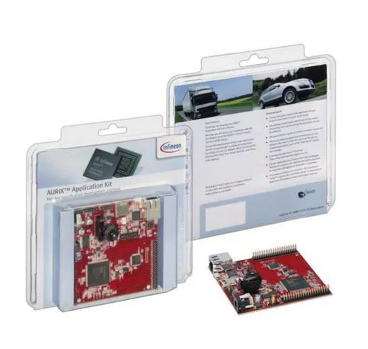

# TLE5502 On-The-Go Calibration Example for TC297

## 1. Document Version
- **Version:** 1.0
- **Date:** March 2026
- **Target MCU:** Infineon AURIX TC297
- **Development Kit:** APPLICATION KIT TC2X7 V1.1
- **Sensor:** TLE5502 Magnetic Position Sensor

---

## 2. Introduction

The TLE5502 **On-The-Go Calibration Example** demonstrates a microcontroller-specific implementation for synchronous readout and **continuous dynamic calibration** of the TLE5502 magnetic position sensor. This example is developed for the Aurix TC297 microcontroller and showcases **parallel ADC conversions** across 4 VADC groups, triggered synchronously by a CCU6 timer.

### Key Differences from One-Time Calibration

This example implements **dynamic continuous calibration** suitable for **one-directional rotation applications** (e.g., motors, fans, pumps). Unlike one-time calibration which requires manual CW and CCW rotations during setup, on-the-go calibration:

- **Automatically calibrates during normal operation** - no manual rotation procedure required
- **Continuously updates calibration parameters** every 1-2 full rotations
- **Compensates for temperature drift and aging effects** in real-time
- **Ideal for uni-directional rotation applications** (always spinning in one direction)
- **Requires continuous rotation** - sensor must be moving to maintain calibration accuracy

### Implementation Features

- **Synchronous 4-channel ADC sampling** of all TLE5502 differential outputs (Sin P, Sin N, Cos P, Cos N)
- **Automatic calibration parameter discovery** using 45° and 135° angle checkpoints
- **Real-time angle calculation** with dynamic calibration compensation
- **Built-in safety mechanisms** (SME1, SME2, SME3) for signal integrity monitoring
- **No initialization procedure required** - calibration begins immediately during rotation

This example was developed for the **APPLICATION KIT TC2X7 V1.1** development board.



---

## 3. Getting Started

### 3.1 Prerequisites
- [Infineon APPLICATION KIT TC2X7 V1.1](https://www.infineon.com/assets/row/public/documents/10/44/infineon-tc2x7-applicationkitmanual-usermanual-en.pdf)
- Aurix Studio [Download from Infineon IDC](https://softwaretools.infineon.com/tools?q=aurix)
- TLE5502 Magnetic Position Sensor
- **Application with continuous one-directional rotation** (motor, fan, wheel, etc.)

### 3.2 Hardware Connection

The TLE5502 sensor has 4 differential analog outputs that must be connected to the TC297 ADC inputs:

| TLE5502 Signal | TC297 Pin | VADC Channel | Description |
|----------------|-----------|--------------|-------------|
| Sin P          | AN3       | VADCG0.3     | Sine Positive |
| Cos P          | AN8       | VADCG1.0     | Cosine Positive |
| Sin N          | AN20      | VADCG2.4     | Sine Negative |
| Cos N          | AN24      | VADCG3.0     | Cosine Negative |

**Power Supply:**
- Connect TLE5502 VDD to 5V from the development kit

**ADC Configuration:**
- Each signal is connected to a separate VADC group (G0, G1, G2, G3)
- This enables true **parallel synchronous conversion** across all 4 channels
- CCU60 timer T12 generates SR3 signal that triggers all 4 conversions simultaneously
- Interrupt is generated on G3 (AN24) completion to signal all channels are ready


---

## 4. Code Description

### 4.1 Aurix TC297 Peripherals

This example uses the following peripherals:

#### 4.1.1 VADC (Versatile Analog-to-Digital Converter)
- **4 VADC Groups** configured for parallel conversion (G0, G1, G2, G3)
- Each group handles one sensor output for true synchronous sampling
- 12-bit resolution ADC readings (0-4095 LSB)
- Queue-based conversion with external trigger (CCU60_SR3)
- Each group's Queue0 is configured with:
  - External trigger mode enabled (`IFXVADC_QUEUE_EXTR`)
  - Trigger source: CCU60_SR3 via REQTRA
  - Rising edge trigger mode
  - Always-open gating
  - Refill mode enabled for continuous operation

#### 4.1.2 CCU60 (Capture/Compare Unit 6)
- **Timer T12** configured as a periodic timer
- Generates **Service Request 3 (SR3)** signal on period match
- SR3 simultaneously triggers all 4 VADC group queues
- Default period: 10000 counts (adjustable for desired sampling rate)
- Configuration:
  - T12 period register (`T12PR`) sets the sampling frequency
  - Period match event routes to SR3 output (`INP.INPT12 = 3`)
  - T12 runs continuously in start/stop mode

#### 4.1.3 Interrupt System
- ISR triggered on completion of AN24 (VADCG3.0) conversion
- Signals that all 4 parallel conversions are complete
- Updates raw ADC values and sets `newSet` flag
- Priority: Configurable via `ADC_SYNC4_ISR_PRIO`
- CPU assignment: `ADC_SYNC4_ISR_CPU`

### 4.2 ADC Synchronous Readout Functions

The `adc_sync4_ccu` module provides the ADC interface:

#### `AdcSync4Ccu_init(AdcSync4Ccu *h)`
Initializes:
- All 4 VADC groups (G0, G1, G2, G3) with external trigger configuration
- 4 ADC channels (AN3, AN8, AN20, AN24) and their result registers
- Patches VADC queue trigger source to CCU60_SR3
- CCU60 T12 timer with period match generating SR3
- Interrupt service routine for AN24 completion

#### `AdcSync4Ccu_start(AdcSync4Ccu *h)`
Starts CCU60 T12 timer to begin periodic SR3 generation and ADC triggering:
- Sets T12RS (run set) bit
- Triggers T12STR (shadow transfer) to load configuration
- ADC conversions begin automatically at configured rate

#### `AdcSync4Ccu_stop(AdcSync4Ccu *h)`
Stops CCU60 T12 timer and halts ADC triggering:
- Sets T12RR (run reset) bit
- Conversions stop but previous data remains accessible

#### Data Acquisition Functions
- `AdcSync4Ccu_getRawAN3()` - Returns latest 12-bit ADC value for Sin P
- `AdcSync4Ccu_getRawAN8()` - Returns latest 12-bit ADC value for Cos P
- `AdcSync4Ccu_getRawAN20()` - Returns latest 12-bit ADC value for Sin N
- `AdcSync4Ccu_getRawAN24()` - Returns latest 12-bit ADC value for Cos N

#### New Data Flag
- `AdcSync4Ccu_fetchNewSetFlag()` - Checks and clears the `newSet` flag
- Returns `1` if new ADC data is available, `0` otherwise
- Provides non-blocking poll mechanism for main loop

### 4.3 On-The-Go Calibration Functions

The `ongocalib` module implements the **dynamic continuous calibration algorithm**:

#### `ONGO_InitCalibData3(ONGO_CALIB_DATA_t *calib_param)`
Initializes calibration data structure for continuous calibration:
- Sets initial min/max values (0 and 4095 for 12-bit ADC)
- Resets angle detection flags (`angle45found`, `angle135found`)
- Resets rotation counter (`nr_valid_rotations = 0`)
- **No pre-calibration required** - parameters learned during operation

**Note:** This function uses automatic initialization. No manual min/max or angle values needed.

#### `ONGO_InitSensorData(sinP_LSB, cosP_LSB, sinN_LSB, cosN_LSB)`
Loads current sensor readings into calibration engine:
- Updates internal sensor data structure
- Calculates differential values (diff_X = CosP - CosN, diff_Y = SinP - SinN)
- Computes uncalibrated angle using `atan2(diff_Y, diff_X)`
- Must be called every ADC sample period

#### `ONGO_CalibrationFindParam(ONGO_CALIB_DATA_t *calib_param)`
Continuously searches for and updates calibration parameters:
- **Tracks min/max values** for all 4 channels (SinP, CosP, SinN, CosN)
- **Detects 45° and 135° angle positions** (within ±0.25° tolerance)
- Captures signal values at these critical angles for orthogonality correction
- **Increments rotation counter** when both 45° and 135° angles are detected in one rotation
- **Recalculates calibration parameters** after each valid rotation:
  - Amplitude correction (amplitudeX, amplitudeY)
  - Offset correction (offsetX, offsetY)
  - Orthogonality correction (sin_ortho, cos_ortho)
  
**Calibration Convergence:** New parameters are calculated after 1-2 complete rotations. The `nr_valid_rotations` counter tracks calibration status.

#### `ONGO_GetCalibAngle(const ONGO_CALIB_DATA_t *calib_param)`
Returns calibrated angle in degrees (0° to 360°):
- Applies offset correction: `corr_X = (diff_X - offsetX) / amplitudeX`
- Applies amplitude normalization: `corr_Y = (diff_Y - offsetY) / amplitudeY`
- Applies orthogonality correction: `ortho_Y = (corr_Y - corr_X * sin_ortho) / cos_ortho`
- Computes final angle: `atan2(ortho_Y, corr_X) * 180/π`
- **Output:** Calibrated angle in degrees

**Note:** Angle accuracy improves after first 1-2 rotations as calibration parameters converge.

#### `ONGO_GetUncalibAngle(void)`
Returns uncalibrated angle in degrees:
- Direct calculation from differential signals
- Useful for initial testing or diagnostic purposes
- Does not apply any calibration corrections

### 4.4 Safety Mechanism Functions

Built-in safety checks validate sensor signal integrity continuously:

#### `SME1_angleComparison_AutoCalibration(calib_param)`
**Angle Comparison Check:**
- Compares angles calculated from P and N channel pairs independently
- Detects signal inconsistencies between positive and negative channels
- Threshold: Angle difference must be < 4.2° (sensor-dependent constant)
- **Use Case:** Detects differential signal corruption, wiring errors, EMI

**Return Value:** 
- `true` (1) = Check **passed**
- `false` (0) = Check **failed** - angle mismatch detected

#### `SME2_1_vectorLength_AutoCalibration(calib_param)`
**Vector Length Check (Differential N Channels):**
- Validates signal vector magnitude for N channels: `sqrt(SinN² + CosN²)`
- Expected range: [0.76 × amplitude, 1.24 × amplitude]
- Detects signal attenuation or amplification issues
- **Use Case:** Identifies magnetic field strength problems, sensor damage

**Return Value:** 
- `true` (1) = Check **passed**
- `false` (0) = Check **failed** - vector length out of range

#### `SME2_2_vectorLengthCheck_AutoCalibration(calib_param)`
**Vector Length Check (Differential P Channels):**
- Validates signal vector magnitude for P channels: `sqrt(SinP² + CosP²)`
- Expected range: [0.76 × amplitude, 1.24 × amplitude]
- Detects signal attenuation or amplification issues on P channels
- **Use Case:** Identifies single-ended P channel problems

**Return Value:** 
- `true` (1) = Check **passed**
- `false` (0) = Check **failed** - vector length out of range

#### `SME2_3_vectorLengthCheck_AutoCalibration(calib_param)`
**Vector Length Check (Full Differential):**
- Validates combined differential vector: `sqrt(diff_X² + diff_Y²)`
- Expected range: [0.76 × amplitude, 1.24 × amplitude]
- Most comprehensive magnitude check
- **Use Case:** Overall signal quality validation

**Return Value:** 
- `true` (1) = Check **passed**
- `false` (0) = Check **failed** - differential vector magnitude issue

#### `SME3_commonModeCheck(calib_param)`
**Common Mode Voltage Check:**
- Monitors average voltage of P and N channels
- Expected range: [0.955 × VDD, 1.045 × VDD] (typically 4.775V - 5.225V for 5V supply)
- Detects power supply issues, DC bias errors, or ground problems
- **Use Case:** Identifies sensor power supply instability

**Return Value:** 
- `true` (1) = Check **passed**
- `false` (0) = Check **failed** - common mode voltage out of specification

---

## 5. Application Flow

### 5.1 Initialization Phase
1. **Disable watchdogs** (for development - re-enable in production)
2. **Initialize ADC system:** `AdcSync4Ccu_init(&g_adc)`
   - Configure VADC groups (G0, G1, G2, G3) and channels
   - Configure CCU60 T12 timer with SR3 trigger output
   - Setup interrupt routing for AN24 completion
3. **Start ADC triggering:** `AdcSync4Ccu_start(&g_adc)`
   - CCU60 T12 begins generating periodic SR3 pulses
   - ADC conversions start automatically
4. **Initialize calibration structure:** `ONGO_InitCalibData3(&calibration_store_params)`
   - Resets all calibration parameters to initial state
   - Prepares for automatic parameter discovery
5. **Wait for first ADC sample** to initialize sensor data

### 5.2 Continuous Operation Phase (Main Loop)

The application operates in a continuous cycle with **no separate calibration phase**:
- **ADC Conversion:**  `AdcSync4Ccu_getRawAN3()`, etc. , updates raw ADC readings
- **New Data Detection:** `AdcSync4Ccu_fetchNewSetFlag()` checks if new ADC data is ready
- **Calibration Angle Calculation:** 
  - `ONGO_InitSensorData()` inputs new sensor readings
  - `ONGO_CalibrationFindParam()` updates calibration parameters
  - `ONGO_GetCalibAngle()` outputs calibrated angle
- **Safety Monitoring:** SME functions check signal integrity
- **Loop Timing:** Execute at least every 10ms (dependant on application requirements)

### 5.3 Calibration Convergence Timeline

**Initial Startup (First 1-2 Rotations):**
- Algorithm searches for min/max signal values
- Detects first occurrence of 45° and 135° angles
- Calculates initial amplitude, offset, and orthogonality corrections
- Angle accuracy: Moderate (uncalibrated baseline)

**After 1-2 Full Rotations:**
- `nr_valid_rotations >= ROTATION_VALID` (default: 1)
- Calibration parameters fully converged
- Angle accuracy: High (meets TLE5502 specifications)

**Continuous Operation:**
- Calibration parameters update every 1-2 rotations
- Compensates for temperature drift, mechanical wear, magnetic field changes
- Real-time adaptation to changing conditions

### 5.4 Operational Requirements

⚠️ **CRITICAL: This calibration method requires continuous rotation**

**Best Suited For:**
- ✅ Motors (continuous operation)
- ✅ Fans and blowers
- ✅ Pumps and compressors
- ✅ Conveyor systems
- ✅ Industrial actuators with frequent motion

**NOT Suited For:**
- ❌ Position sensors with infrequent motion
- ❌ Bidirectional applications with direction changes
- ❌ Static position holding
- ❌ Manual angle setting applications

**For bidirectional or infrequent rotation applications, use the One-Time Calibration example instead.**

---

## 6. Key Features

### 6.1 Parallel Conversion Architecture
- **True synchronous sampling**: All 4 channels converted simultaneously
- **Eliminates phase delay**: Critical for accurate angle calculation
- **Uses 4 separate VADC groups**: Enables parallel operation
- **Single trigger source**: CCU60 T12 SR3 ensures precise timing synchronization
- **Sub-microsecond timing accuracy**: Hardware-based synchronization

### 6.2 CCU60-Based Triggering
- **Dedicated timer hardware**: CCU60 T12 provides reliable periodic triggering
- **Service Request 3 (SR3)**: Routes directly to all VADC group queue triggers
- **Configurable sampling rate**: Adjust T12PR register for desired frequency
- **Low CPU overhead**: Hardware-based triggering without software intervention
- **Deterministic timing**: No jitter or latency from software loops

### 6.3 On-The-Go Calibration
- **No manual calibration procedure**: Parameters discovered automatically during rotation
- **Dynamic adaptation**: Continuous updates every 1-2 rotations
- **Temperature compensation**: Tracks thermal drift in real-time
- **Aging compensation**: Adapts to long-term sensor changes
- **Minimal initialization**: Only requires `ONGO_InitCalibData3()` call
- **Fast convergence**: Usable angle after first 1-2 rotations

**Calibration Parameters Automatically Calculated:**
- Amplitude correction (X and Y channels, P and N separately)
- Offset correction (X and Y channels, P and N separately)
- Orthogonality correction (sin and cos of phase error)
- Min/max signal levels (adaptive tracking)

**Calibration Algorithm:**
1. Track min/max values for all 4 channels continuously
2. Detect when angle passes through 45° ±0.25° window
3. Capture signal values at 45° position
4. Detect when angle passes through 135° ±0.25° window
5. Capture signal values at 135° position
6. When both positions detected in one rotation:
   - Calculate amplitude and offset from min/max values
   - Calculate orthogonality error from 45° and 135° samples
   - Update calibration parameters for next angle calculation
7. Repeat continuously to track environmental changes

### 6.4 Safety Mechanisms
- **5 independent safety monitors**: SME1, SME2 (3 variants), SME3
- **Real-time signal validation**: Checks run every ADC sample
- **Multiple failure modes detected**:
  - Angle inconsistency between P and N channels (SME1)
  - Signal amplitude too low or high (SME2 variants)
  - Common mode voltage deviation (SME3)
- **Pass/fail statistics**: Application tracks `passes` and `fails` counters
- **Diagnostic capability**: Identify sensor faults, wiring issues, magnetic field problems

**Typical Failure Indications:**
- High SME1 failures: Wiring problem, EMI, sensor damage
- High SME2 failures: Weak magnet, airgap too large, sensor attenuation
- High SME3 failures: Power supply instability, ground bounce, DC bias error

### 6.5 Advantages Over One-Time Calibration

| Feature | On-The-Go Calibration | One-Time Calibration |
|---------|----------------------|---------------------|
| **Initial Setup** | Automatic during rotation | Manual CW + CCW rotations required |
| **Temperature Compensation** | ✅ Continuous adaptation | ❌ Fixed at calibration temperature |
| **Aging Compensation** | ✅ Tracks long-term changes | ❌ Requires recalibration |
| **Application Type** | Uni-directional continuous rotation | Any application (bi-directional, static) |
| **Calibration Time** | 1-2 rotations during normal operation | Setup phase: 2 full rotations (CW + CCW) |
| **Accuracy Over Time** | ✅ Maintains accuracy indefinitely | ⚠️ Degrades with temperature/aging |
| **Mechanical Setup** | Must be installed in final application | Can calibrate on test bench |

---

## 7. Configuration Parameters

### 7.1 CCU60 Timer Configuration
- **Default T12 Period**: 10000 counts (configurable in `initCcu60_T12_PeriodMatch_Sr3()`)
- **Trigger Output**: SR3 (Service Request 3)
- **Trigger Event**: T12 period match (every T12PR counts)
- **Clock Source**: CCU60 module clock (fCCU6)

**Sampling Frequency Calculation:**

**Example:** If fCCU6 = 100 MHz and T12PR = 10000, then f_sample = 10 kHz

**Recommended Sampling Rates:**
- **High-speed applications** (>10,000 RPM): 10-20 kHz
- **Medium-speed applications** (1,000-10,000 RPM): 5-10 kHz
- **Low-speed applications** (<1,000 RPM): 1-5 kHz

⚠️ **Note:** Higher sampling rates improve transient response but increase CPU load. Balance sampling rate with application requirements.

### 7.2 VADC Trigger Configuration
- **Trigger Source**: CCU60_SR3 via REQTRA
- **Trigger Mode**: Rising edge (`IfxVadc_TriggerMode_uponRisingEdge`)
- **Gating Mode**: Always enabled (`IfxVadc_GatingMode_always`)
- **Queue Mode**: External trigger with refill (`IFXVADC_QUEUE_EXTR | IFXVADC_QUEUE_REFILL`)
- **Result Handling**: Valid Flag (VF) checked by ISR to ensure conversion completed

### 7.3 Interrupt Configuration
- **ISR Priority**: `ADC_SYNC4_ISR_PRIO` (default: 0, adjustable in header file)
- **CPU Assignment**: `ADC_SYNC4_ISR_CPU` (default: CPU0)
- **Trigger Source**: AN24 (VADCG3.0) conversion complete event
- **ISR Latency**: Minimal overhead - only reads 4 result registers and sets flag

### 7.4 Calibration Algorithm Parameters

Defined in `ongocalib.h`:

| Parameter | Default Value | Description |
|-----------|--------------|-------------|
| `ANGLE_TOLERANCE` | 0.25° | Detection window for 45° and 135° angles |
| `ROTATION_VALID` | 1 | Number of valid rotations before recalculating calibration |
| `SME_VAL1` | 4.2° | Angle comparison threshold (sensor-specific) |
| `SME_VAL2_LOW` | 0.76 | Vector length lower bound (76% of amplitude) |
| `SME_VAL2_HIGH` | 1.24 | Vector length upper bound (124% of amplitude) |
| `SME_VAL3_VCM_POS` | 0.08 | Common mode upper deviation (+8%) |
| `SME_VAL3_VCM_NEG` | -0.08 | Common mode lower deviation (-8%) |

**Tuning Guidelines:**
- **ANGLE_TOLERANCE**: Tighter tolerance (e.g., 0.1°) improves orthogonality accuracy but may miss angle windows at very low speeds
- **ROTATION_VALID**: Increase to average over multiple rotations for noisy environments
- **SME thresholds**: Adjust based on sensor variant (TLE5501 vs TLE5502) and application requirements

---

## 8. Performance Characteristics

### 8.1 Angle Accuracy

**Uncalibrated Accuracy:** ±2-5° (typical for TLE5502 without calibration)

**Calibrated Accuracy:**
- **First rotation**: ±1-2° (parameters converging)
- **After 2+ rotations**: ±0.1-0.5° (typical, depends on mechanical setup)
- **Long-term stability**: ±0.1-0.5° (maintained with continuous calibration updates)

**Factors Affecting Accuracy:**
- Magnetic field homogeneity
- Mechanical alignment tolerance
- ADC resolution (12-bit = 0.088° theoretical resolution)
- Temperature stability
- Rotation speed consistency

### 8.2 Calibration Convergence Time

| Rotation Speed | Time to First Calibration | Sampling Rate |
|---------------|-------------------------|--------------|
| 10,000 RPM | ~12 ms (2 rotations) | 10 kHz |
| 3,000 RPM | ~40 ms (2 rotations) | 10 kHz |
| 1,000 RPM | ~120 ms (2 rotations) | 5 kHz |
| 300 RPM | ~400 ms (2 rotations) | 2 kHz |

**Notes:**
- First usable angle available after detecting 45° and 135° positions (partial rotation)
- Full calibration accuracy achieved after 1-2 complete rotations
- Subsequent updates every 1-2 rotations maintain accuracy

### 8.3 CPU Load Estimation

**Per Sample (Typical TC297 @ 300 MHz):**
- ADC ISR: ~2 μs (read 4 channels + set flag)
- `ONGO_InitSensorData()`: ~5 μs (calculate differentials + atan2)
- `ONGO_CalibrationFindParam()`: ~10 μs (min/max tracking + angle detection)
- `ONGO_GetCalibAngle()`: ~8 μs (apply corrections + atan2)
- Safety checks (5 functions): ~15 μs total
- **Total per sample**: ~40 μs

**At 10 kHz sampling rate:**
- CPU load: (40 μs × 10,000) / 1,000,000 μs = **0.4% of one core**

**Parameter Recalculation (every 1-2 rotations):**
- One-time computational spike: ~100-200 μs
- Frequency: Depends on rotation speed (e.g., 3000 RPM = 50 Hz)
- Impact: Negligible (<0.01% average load)

---

## 9. Troubleshooting

### 9.1 Common Issues

#### **Issue: Angle values not updating**
**Symptoms:** `angle_read` stays at 0 or constant value

**Possible Causes:**
- CCU60 timer not running → Check `AdcSync4Ccu_start()` was called
- ADC not triggering → Verify SR3 routing in debugger
- `newSet` flag not clearing → Check main loop calls `fetchNewSetFlag()`

**Debug Steps:**
1. Set breakpoint in ISR to verify conversions are happening
2. Check `g_adc.newSet` flag in watch window
3. Verify CCU60.T12.TCTR.T12R bit is set (timer running)

#### **Issue: High fail rate in safety checks**
**Symptoms:** `fails` counter increments rapidly

**Possible Causes:**
- SME1 failures: Wiring error, loose connection, EMI
- SME2 failures: Weak magnet, large airgap, sensor damage
- SME3 failures: Power supply noise, incorrect VDD voltage

**Debug Steps:**
1. Monitor individual SME function returns to isolate which check is failing
2. Verify sensor power supply is stable 5V ±5%
3. Check mechanical airgap (<2mm recommended for TLE5502)
4. Inspect wiring for proper shielding and grounding

#### **Issue: Calibration not converging**
**Symptoms:** `nr_valid_rotations` stays at 0, angle accuracy poor

**Possible Causes:**
- Sensor not rotating continuously
- Rotation too slow to detect 45° and 135° angles
- Mechanical vibration causing angle jitter at detection windows

**Debug Steps:**
1. Monitor `calibration_store_params.rotation_data.angle45found` and `angle135found` flags
2. Verify uncalibrated angle (`ONGO_GetUncalibAngle()`) is changing smoothly
3. Check `ANGLE_TOLERANCE` is appropriate for rotation speed
4. Increase sampling rate if rotation is very fast

#### **Issue: Angle jumps or discontinuities**
**Symptoms:** Sudden angle changes, non-smooth rotation

**Possible Causes:**
- Magnetic field non-homogeneity
- Mechanical eccentricity (wobble)
- EMI interference

**Debug Steps:**
1. Verify magnet is properly centered and secured
2. Check raw ADC values for smooth sinusoidal waveforms
3. Add filtering or increase `ROTATION_VALID` to average over more rotations
4. Inspect for nearby magnetic interference sources

### 9.2 Diagnostic Code Examples

**Monitor calibration status:**
```c
// Example: Monitor calibration status in main loop
if (AdcSync4Ccu_fetchNewSetFlag())
{
    // New ADC data available, process calibration
    int16_t sinP = AdcSync4Ccu_getRawAN3();
    int16_t cosP = AdcSync4Ccu_getRawAN8();
    int16_t sinN = AdcSync4Ccu_getRawAN20();
    int16_t cosN = AdcSync4Ccu_getRawAN24();

    ONGO_InitSensorData(sinP, cosP, sinN, cosN);
    ONGO_CalibrationFindParam(&calibration_store_params);
    float calibratedAngle = ONGO_GetCalibAngle(&calibration_store_params);

    // TODO: Use calibrated angle for control algorithm
}
````````

**Verify ADC synchronization:**
```c
// Example: Check ADC synchronization in ISR
void ADC_SYNC4_ISR(void)
{
    // Read raw ADC values (triggered by AN24 conversion complete)
    int16_t rawSinP = VADC_G0_CH3.R_VALUE;
    int16_t rawCosP = VADC_G1_CH0.R_VALUE;
    int16_t rawSinN = VADC_G2_CH4.R_VALUE;
    int16_t rawCosN = VADC_G3_CH0.R_VALUE;

    // Update global ADC structure
    g_adc.rawAN3 = rawSinP;
    g_adc.rawAN8 = rawCosP;
    g_adc.rawAN20 = rawSinN;
    g_adc.rawAN24 = rawCosN;
    g_adc.newSet = 1; // Set new data flag

    // TODO: Add any additional processing or diagnostics
}
````````

---

## 10. Project Structure

```
tle5502_tc297_integrationexample_syncreadouts/
├── APPLICATIONS_KIT_TC2X7_V1_1_Documents/
│   ├── ... (Infineon provided documentation)

├── Src/
│   ├── ongo_calib.c             # Implementation of on-the-go calibration algorithms
│   ├── adc_sync4_ccu.c          # Implementation of ADC synchronous readout functions
│   ├── Cpu0_Main.c                   # Main application code
│   ├── ongo_calib.h             # Public interface for on-the-go calibration module
│   ├── adc_sync4_ccu.h          # Public interface for ADC synchronous readout module
│   ├── ... (other source files)
├── images/
│   ├── APPLICATIONKIT.png        # Development kit image for documentation
│   ├── pozacuconexiunile.png    # Hardware connection illustration
├── README.md                    # This readme file
└── ... (other project files)
````````

## 11. Supported Tools and Environments

- **Infineon AURIX TC297**: Target microcontroller
- **APPLICATION KIT TC2X7 V1.1**: Development kit
- **Aurix Studio**: IDE and project development environment
- **GHS, TASKING, or AMD AURIX compilers**: Supported toolchains
- **Infineon Debugger**: For programming and debugging the TC297

---

## 12. Further Information

### 12.1 Reference Documentation

- [TLE5502 Product Page](https://www.infineon.com/cms/en/product/sensor/magnetic-sensors/magnetic-position-sensors/angle-sensors/tle5502/)
- [TLE5502 Datasheet](https://www.infineon.com/dgdl/Infineon-TLE5502-DataSheet-v02_00-EN.pdf?fileId=5546d462766cbe860176d2d4b11f5c4c)
- [TLE5xxx Calibration Application Note](https://www.infineon.com/dgdl/Infineon-TLE5xxx(D)_Calibration_360_AN-v02_00-AN-v02_00-EN.pdf?fileId=5546d46264a8de7e0164f09d8bfa228d)
- [AURIX TC2xx User Manual](https://www.infineon.com/dgdl/Infineon-AURIX_TC2xx_Part1-UserManual-v01_00-EN.pdf?fileId=5546d46269bda8df0169ca094cad22dc)
- [CCU6 Timer Unit Documentation](https://www.infineon.com/dgdl/Infineon-AURIX_TC2xx_Part2-UserManual-v01_00-EN.pdf?fileId=5546d46269bda8df0169ca09515622e3)
- [VADC Module Documentation](https://www.infineon.com/dgdl/Infineon-AURIX_TC2xx_Part2-UserManual-v01_00-EN.pdf?fileId=5546d46269bda8df0169ca09515622e3)
- [iLLD API Documentation](https://www.infineon.com/cms/en/tools/aurix-tools/free-aurix-software-and-tools/illd/)

### 12.2 Related Examples

**Companion Examples in This Repository:**
- **One-Time Calibration Example** - For applications with infrequent rotation or bidirectional operation
- **CCU-Based Triggering Example** - Alternative trigger source using GTM TOM module

### 12.3 Support and Contact

For technical support with this example code:
- [Infineon Developer Community](https://community.infineon.com/)
- [AURIX Forum](https://community.infineon.com/t5/AURIX/bd-p/AURIX)
- [TLE5502 Technical Support](https://www.infineon.com/cms/en/product/sensor/magnetic-sensors/)

---

## 13. Revision History

| Version | Date | Author | Description |
|---------|------|--------|-------------|
| 1.0 | March 2026 | Infineon | Initial release with on-the-go calibration |

---

## 14. License

Copyright (C) Infineon Technologies AG 2025

Boost Software License - Version 1.0 - August 17th, 2003

Permission is hereby granted, free of charge, to any person or organization obtaining a copy of the software and accompanying documentation covered by this license (the "Software") to use, reproduce, display, distribute, execute, and transmit the Software, and to prepare derivative works of the Software, and to permit third-parties to whom the Software is furnished to do so, all subject to the following conditions:

The copyright notices in the Software and this entire statement, including the above license grant, this restriction and the following disclaimer, must be included in all copies of the Software, in whole or in part, and all derivative works of the Software, unless such copies or derivative works are solely in the form of machine-executable object code generated by a source language processor.

THE SOFTWARE IS PROVIDED "AS IS", WITHOUT WARRANTY OF ANY KIND, EXPRESS OR IMPLIED, INCLUDING BUT NOT LIMITED TO THE WARRANTIES OF MERCHANTABILITY, FITNESS FOR A PARTICULAR PURPOSE, TITLE AND NON-INFRINGEMENT.