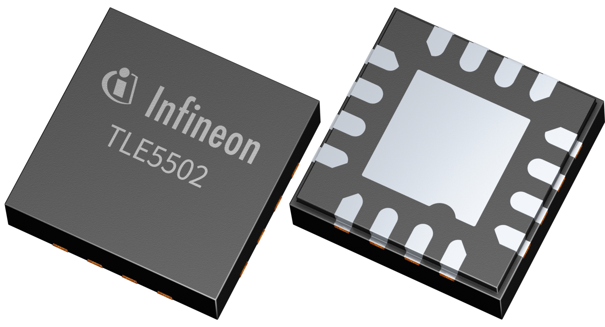
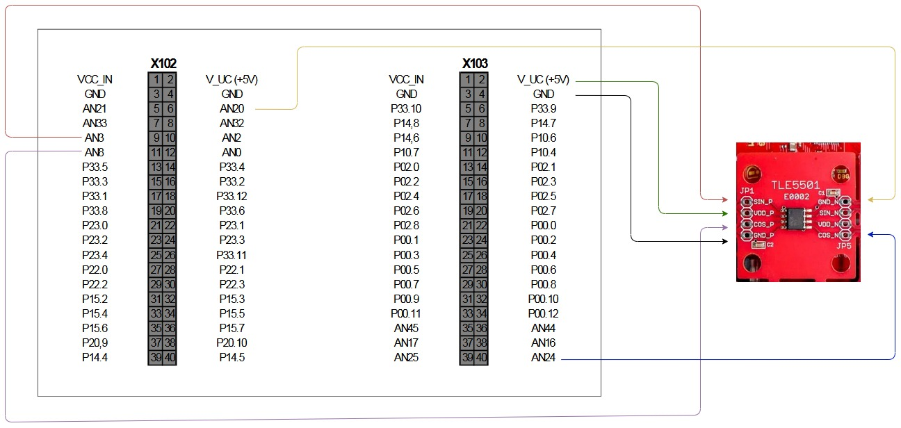

# 1. TLE5502 Example Code - Aurix TC297 Synchronous Readout with One-Time Calibration



## 2. Introduction

The TLE5502 Example Code demonstrates a microcontroller-specific implementation for synchronous readout and one-time calibration of the TLE5502 magnetic position sensor. This example is developed for the Aurix TC297 microcontroller and showcases **parallel ADC conversions** across 4 VADC groups, triggered synchronously by a CCU6 timer.

The implementation features:
- **Synchronous 4-channel ADC sampling** of all TLE5502 differential outputs (Sin P, Sin N, Cos P, Cos N)
- **One-time calibration** procedure with clockwise (CW) and counter-clockwise (CCW) rotation
- **Real-time angle calculation** with calibration compensation
- **Built-in safety mechanisms** (SME1, SME2, SME3) for signal integrity monitoring

This example was developed for the **APPLICATION KIT TC2X7 V1.1** development board.


## 3. Getting Started

### 3.1 Prerequisites
- [Infineon APPLICATION KIT TC2X7 V1.1](https://www.infineon.com/assets/row/public/documents/10/44/infineon-tc2x7-applicationkitmanual-usermanual-en.pdf)
- Aurix Studio [Download from Infineon IDC](https://softwaretools.infineon.com/tools?q=aurix)
- TLE5502 Magnetic Position Sensor

### 3.2 Hardware Connection

The TLE5502 sensor has 4 differential analog outputs that must be connected to the TC297 ADC inputs:

| TLE5502 Signal | TC297 Pin | VADC Channel | Description |
|----------------|-----------|--------------|-------------|
| Sin P          | AN3       | VADCG0.3     | Sine Positive |
| Cos P          | AN8       | VADCG1.0     | Cosine Positive |
| Sin N          | AN20      | VADCG2.4     | Sine Negative |
| Cos N          | AN24      | VADCG3.0     | Cosine Negative |

**Power Supply:**
- Connect TLE5502 VDD to 5V from the development kit

**ADC Configuration:**
- Each signal is connected to a separate VADC group (G0, G1, G2, G3)
- This enables true **parallel synchronous conversion** across all 4 channels
- CCU60 timer T12 generates SR3 signal that triggers all 4 conversions simultaneously
- Interrupt is generated on G3 (AN24) completion to signal all channels are ready




## 4. Code Description

### 4.1 Aurix TC297 Peripherals

This example uses the following peripherals:

#### 4.1.1 VADC (Versatile Analog-to-Digital Converter)
- **4 VADC Groups** configured for parallel conversion (G0, G1, G2, G3)
- Each group handles one sensor output for true synchronous sampling
- 12-bit resolution ADC readings
- Queue-based conversion with external trigger (CCU60_SR3)
- Each group's Queue0 is configured with:
  - External trigger mode enabled (`IFXVADC_QUEUE_EXTR`)
  - Trigger source: CCU60_SR3 via REQTRA
  - Rising edge trigger mode
  - Always-open gating

#### 4.1.2 CCU60 (Capture/Compare Unit 6)
- **Timer T12** configured as a periodic timer
- Generates **Service Request 3 (SR3)** signal on period match
- SR3 simultaneously triggers all 4 VADC group queues
- Default period: 10000 counts (adjustable for desired sampling rate)
- Configuration:
  - T12 period register (`T12PR`) sets the sampling frequency
  - Period match event routes to SR3 output (`INP.INPT12 = 3`)
  - T12 runs continuously in start/stop mode

#### 4.1.3 Interrupt System
- ISR triggered on completion of AN24 (VADCG3.0) conversion
- Signals that all 4 parallel conversions are complete
- Updates raw ADC values and sets `newSet` flag
- Priority: Configurable via `ADC_SYNC4_ISR_PRIO`
- CPU assignment: `ADC_SYNC4_ISR_CPU`

### 4.2 ADC Synchronous Readout Functions

The `adc_sync4_gtm` module provides the ADC interface:

#### Initialization

Initializes:
- All 4 VADC groups (G0, G1, G2, G3) with external trigger configuration
- 4 ADC channels (AN3, AN8, AN20, AN24) and their result registers
- Patches VADC queue trigger source to CCU60_SR3
- CCU60 T12 timer with period match generating SR3
- Interrupt service routine for AN24 completion

#### Start/Stop Triggering
- `start()`: Starts CCU60 T12 timer to begin periodic SR3 generation and ADC triggering
  - Sets T12RS (run set) bit
  - Triggers T12STR (shadow transfer) to load configuration
- `stop()`: Stops CCU60 T12 timer and halts ADC triggering
  - Sets T12RR (run reset) bit

#### Data Acquisition
Returns the latest raw 12-bit ADC value for each channel.

#### New Data Flag
- Checks and clears the `newSet` flag
- Returns `1` if new ADC data is available, `0` otherwise

### 4.3 TLE5502 Calibration Functions

The `onecalib` module implements the one-time calibration algorithm:

#### Initialize Calibration Structure
Initializes calibration data structure for storing CW and CCW rotation parameters.

#### Load Sensor Data
- **Input:**
  - `calibration_store_params`: Pointer to calibration data structure
  - `CW`: Set `TRUE` for clockwise rotation calibration
  - `CCW`: Set `TRUE` for counter-clockwise rotation calibration
- **Process:** Accumulates min/max values during a full rotation to compute offset and gain corrections
- **Output:** Sets `calibration_done` flag when full rotation is detected

#### Get Calibrated Angle
- Returns calibrated angle in degrees (0-360°)
- Applies offset and gain compensation from calibration data
- Only valid after `full_calibration_performed` flag is set

### 4.4 Safety Mechanism Functions

Built-in safety checks validate sensor signal integrity:

#### SME1: Angle Comparison Check
Compares angles calculated from different signal pairs to detect inconsistencies.

#### SME2: Vector Length Checks
Validates that the signal vector magnitude remains within expected bounds.

#### SME3: Common Mode Check
Monitors the common mode voltage of differential signals.

**Return Value:** 
- `TRUE` (1) = Check passed
- `FALSE` (0) = Check failed (potential sensor or connection issue)

## 5. Application Flow

### 5.1 Initialization Phase
1. Disable watchdogs
2. Initialize ADC synchronous readout (`AdcSync4Gtm_init`)
   - Configure VADC groups and channels
   - Configure CCU60 T12 timer
   - Setup SR3 trigger routing
3. Start CCU60 triggering (`AdcSync4Gtm_start`)
4. Initialize calibration data structure (`ONECALIB_InitCalibData`)

### 5.2 Calibration Phase

#### Step 1: Clockwise (CW) Rotation Calibration
**User Action Required:** Rotate the sensor/magnet **one full clockwise rotation**

#### Step 2: Counter-Clockwise (CCW) Rotation Calibration
**User Action Required:** Rotate the sensor/magnet **one full counter-clockwise rotation**

After both rotations, `full_calibration_performed` flag is set.

### 5.3 Normal Operation Phase

## 6. Key Features

### 6.1 Parallel Conversion Architecture
- **True synchronous sampling**: All 4 channels converted simultaneously
- **Eliminates phase delay**: Critical for accurate angle calculation
- **Uses 4 separate VADC groups**: Enables parallel operation
- **Single trigger source**: CCU60 T12 SR3 ensures precise timing synchronization

### 6.2 CCU60-Based Triggering
- **Dedicated timer hardware**: CCU60 T12 provides reliable periodic triggering
- **Service Request 3 (SR3)**: Routes directly to all VADC group queue triggers
- **Configurable sampling rate**: Adjust T12PR register for desired frequency
- **Low CPU overhead**: Hardware-based triggering without software intervention

### 6.3 One-Time Calibration
- **CW and CCW rotation**: Compensates for sensor and mechanical asymmetries
- **Automatic min/max detection**: No manual threshold setting required
- **Persistent calibration**: Parameters stored in `CALIB_DATA_t` structure
- **Real-time compensation**: Applied to every angle reading

### 6.4 Safety Mechanisms
- **Multiple redundant checks**: 5 independent safety monitors
- **Signal integrity validation**: Detects sensor faults, wiring issues, and magnetic field problems
- **Pass/fail counting**: Application tracks safety check statistics

## 7. Configuration Parameters

### 7.1 CCU60 Timer Configuration
- **Default T12 Period**: 10000 counts (configurable in `initCcu60_T12_PeriodMatch_Sr3()`)
- **Trigger Output**: SR3 (Service Request 3)
- **Trigger Event**: T12 period match (every T12PR counts)
- **Clock Source**: CCU60 module clock (fCCU6)

**Sampling Frequency Calculation:**
````````markdown
Example: If fCCU6 = 100 MHz and T12PR = 10000, then f_sample = 10 kHz

### 7.2 VADC Trigger Configuration
- **Trigger Source**: CCU60_SR3 via REQTRA
- **Trigger Mode**: Rising edge (`IfxVadc_TriggerMode_uponRisingEdge`)
- **Gating Mode**: Always enabled (`IfxVadc_GatingMode_always`)
- **Queue Mode**: External trigger with refill (`IFXVADC_QUEUE_EXTR | IFXVADC_QUEUE_REFILL`)

### 7.3 Interrupt Configuration
- **ISR Priority**: `ADC_SYNC4_ISR_PRIO` (default: 0, adjustable)
- **CPU Assignment**: `ADC_SYNC4_ISR_CPU` (default: CPU0)
- **Trigger Source**: AN24 (VADCG3.0) conversion complete

## 8. Notes

- **Calibration requirement**: Must perform both CW and CCW rotations before obtaining valid angle readings
- **ADC resolution**: 12-bit (0-4095 LSB range)
- **Sampling rate**: Configured via CCU60 T12PR register (default: 10000 counts)
- **Trigger synchronization**: CCU60 SR3 ensures all 4 VADC groups trigger simultaneously
- **Interrupt priority**: Ensure VADC interrupt priority allows timely servicing
- **Safety monitoring**: Monitor `fails` counter; high failure rate indicates sensor/connection issues
- **CCU60 clock**: Verify CCU60 module clock frequency for accurate sampling rate calculation

## 9. Project Structure

```bash
C/
├── images/                   # Image files for documentation
│   ├── APPLICATIONKIT.png
│   └── TLE5502.png
├── README.md                 # Main documentation file
└── src/                     # Source code files
    ├── adc_sync4_gtm.c      # ADC synchronous readout implementation
    ├── adc_sync4_gtm.h      # ADC synchronous readout header file
    ├── onecalib.c           # One-time calibration implementation
    ├── onecalib.h           # One-time calibration header file

````````

## 10. Further Information

For more details on the TLE5502 sensor and calibration algorithms, refer to:
- TLE5502 Product Page and User Manual
- Infineon AURIX TC2xx User Manuals
- CCU6 Timer Unit Documentation
- VADC (Versatile ADC) Module Documentation
- iLLD (Infineon Low Level Driver) Documentation