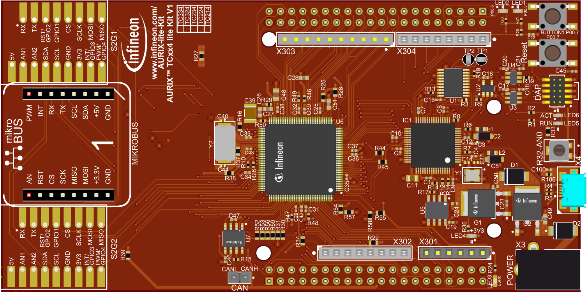

  
TODO: Check the "Images" folder and DELETE the unused pictures.

# < Project name>
  
**< Abstract of your code example >**  

## Device  
The device used in this example is TC33xLP_A-Step  

## Board  
The board used for testing is KIT_A2G_TC334_LITE  
  

## Scope of work  
< Description of your code example >  

## Introduction  
< Introduction: A generic introduction on the used modules and their main features >  

## Hardware setup  
< Hardware setup: What hardware is needed to run the code (kits, cables, wires, shields) >  

##  

## Implementation  
< A detailed explanation of how to implement the module's configuration using iLLDs and exploits their features >  

## Compiling and programming
Before testing this code example:  
- (optional: REMOVE THIS POINT IF NOT REQUIRED) Power the board through the dedicated power connector 
- Connect the board to the PC through the USB interface
- (optional: REMOVE THIS POINT IF NOT REQUIRED) Open a serial terminal inside the AURIX&trade; Development Studio using the following icon:  

    

  The serial terminal must be configured with the following parameters to enable the communication between the board and the PC:
    - Serial port: Select the COM port assigned to your hardware
    - Speed (baud): 115200
    - Data bits: 8
    - Stop bit: 1

- Build the project using the dedicated Build button  or by right-clicking the project name and selecting "Build Project"
- (optional: KEEP ONE AND REMOVE THE OTHER) To flash the device and immediately run the program, click on the dedicated Flash button   
- (optional: KEEP ONE AND REMOVE THE OTHER) To flash the device and start a debug session, click on the Debug button  and create a configuration for a debugger (double clicking on the debugger name, a default configuration is created)

## Run and Test   
< The steps to follow to make sure the code is working properly and interact with it >  

## References  

AURIX&trade; Development Studio is available online:  
- <https://www.infineon.com/aurixdevelopmentstudio>  
- Use the "Import..." function to get access to more code examples  

More code examples can be found on the GIT repository:  
- <https://github.com/Infineon/AURIX_code_examples>  

For additional trainings, visit our webpage:  
- <https://www.infineon.com/aurix-expert-training>  

For questions and support, use the AURIX&trade; Forum:  
- <https://community.infineon.com/t5/AURIX/bd-p/AURIX>  
