# TLE5501 PSC3M5_CC2 Integration Example
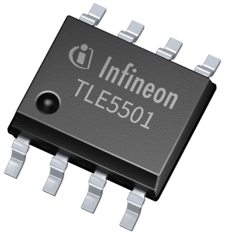

<br>

## 1. Introduction

This code example provides a starting point for interfacing the TLE5501 TMR angle sensor with a PSOC&trade; Control C3 microcontroller. <br>
The development boards used for this example code are:
- **TLE5501 Angle Shield** v3.1, featuring the **E0002** sensor variant
    - [Evaluation Kit Infineon website](https://www.infineon.com/cms/en/product/evaluation-boards/tle5501-evalkit/)
    - [Sensor Infineon website](https://www.infineon.com/cms/en/product/sensor/magnetic-sensors/magnetic-position-sensors/angle-sensors/tle5501-e0002/)
- **PSOC&trade; Control C3M5 Motor Drive Control Card** (KIT_PSC3M5_CC2), featuring the **PSC3M5FDS2AFQ1** MCU; 
    - [Evaluation Board Infineon website](https://www.infineon.com/evaluation-board/KIT-PSC3M5-CC2)

>Note: The provided example is not a qualified solution and is provided "as-is".

<br>

### 1.1. Short Description

This example code performs differential, continuous analog readout of the TLE5501 TMR angle sensor, at a frequency of ~20Hz. <br>
For easier interpretation and visualization, the following data is transmitted to the serial port:
- Differential SIN component (SIN_P - SIN_N), in radians;
- Differential COS component (COS_P - COS_N), in radians;
- Calculated angle, in degrees.

The continuous analog readout is performed through the use of two dedicated peripherals of the PSOC&trade; Control C3M MCU:
- **HPPASS (High Performance Programmable Analog Subsystem):** 12-bit SAR ADC, featuring pseudo-differential analog-to-digital conversion;
- **DMA**: Interrupt-based transport of HPPASS conversion results to memory.

Peripheral configuration is detailed in **Section 2.3**.

<br>

## 2. Getting Started

### 2.1. Hardware Connections

The block diagram below shows the required connections between the TLE5501 sensor and the KIT_PSC3M5_CC2 board. Additional components, such as **decoupling capacitors**, are not depicted. **Please refer to the [TLE5501 Data Sheet](https://www.infineon.com/dgdl/Infineon-Infineon-TLE5501-DS-v01_00--DataSheet-v01_00-EN.pdf?fileId=5546d46264a8de7e0164eca986da1a32) for more details!** <br>
Analog-to-digital conversions can be done on any of the available differential channels, while **the pin labels in the schematic correspond to the pins used in the provided code example**. <br>

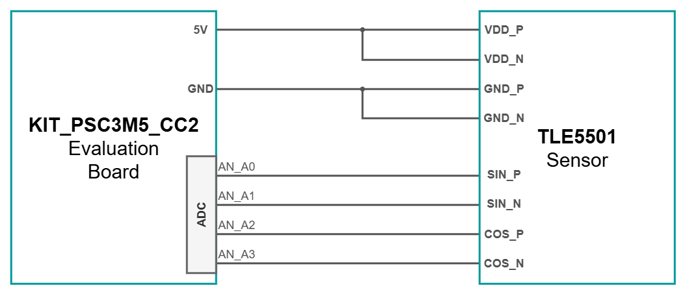

<br>

### 2.2. Project Importing in ModusToolbox&trade; 

This example code was developed using the ModusToolbox&trade; Eclipse IDE, version 2025.4. For more details about the software, check the following links:
- [ModusToolbox&trade; tools package installation guide](https://www.infineon.com/assets/row/public/documents/30/68/infineon-modustoolbox-tools-package-user-guide-gettingstarted-en.pdf) for information about installing and configuring the tools package;
- [Eclipse IDE for ModusToolbox&trade; user guide](https://www.infineon.com/assets/row/public/documents/30/44/infineon-modustoolbox-eclipse-ide-user-guide-usermanual-en.pdf) (locally available at *{ModusToolbox&trade; install directory}/docs_{version}/mt_ide_user_guide.pdf*).

Once installed, the example code project can be imported onto your machine:
1. Create a new folder that will act as your ModusToolbox&trade; workspace;
1. Inside the created folder, right click, Git Bash Here, clone the code example repository;
1. Open ModusToolbox&trade; Eclipse IDE;
1. From the top ribbon, go to **File -> Switch Workspace -> Other... -> Browse...**, and find your workspace folder;
1. From the **Quick Panel** or **File -> Import... -> ModusToolbox&trade;**, select **Import Existing Application In-Place**;
1. Select the copied repository folder and wait for the software to finish importing;
1. Make sure **Project Explorer** includes both **mtb_shared** and the copied repository;
1. If the project does not build, open a **Terminal** tab inside the IDE and run the command `make getlibs`.

<br>

### 2.3. Peripheral Configuration

This chapter represents a rundown of the configuration done in the **Device Configurator** for all the peripherals used in the example code, and can be used as a reference or for configuring a new project:
- **SCB**, for UART communication with the PC;
- **HPPASS**, for doing the pseudo-differential analog-to-digital conversions;
- **DMA**, for extracting the data out of the HPPASS peripheral into the memory; 

<br>

<details><summary><b>SCB</b></summary>

1. Select the **Peripherals** tab of the **Device Configurator**;
1. Select and enable **Serial Communication Block (SCB) 1** (renaming optional);
1. Set the peripheral personality to **UART-3.0**;
1. Under **General**:
    - **Baud Rate (bps)**: 115200 baudrate 
    - **Data Width**: 8 bits;
    - **Parity**: None 
    - **Stop Bits**: 1 bit;
- Under **Connections**:
    - **Clock**: 8 bit Divider 1 clk;
    - **RX**: P2[2];
    - **TX**: P2[3];

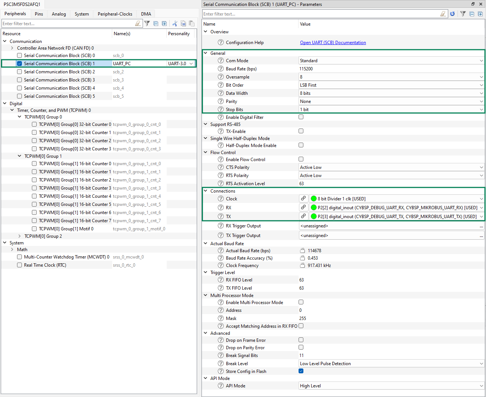

</details>

<br>

<details><summary><b>HPPASS</b></summary>

Overall, the operation of the HPPASS peripheral can be reduced to the following steps:
- The HPPASS has two states: 
    - State 0: Waits for a firmware trigger and proceeds to State 1;
    - State 1: Sends a sampling trigger to the configured channels and resets to State 0;
- **Conversion trigger** is sent to HPPASS by a **firmware instruction**;
- The HPPASS receives the **conversion trigger** and sends the **sampling trigger** to the configured channels;
- The four configured channels (**two differential pairs**) output **two 32-bit results** to **FIFO 0**;
- When FIFO 0 detects two elements inside, it sends another trigger to the DMA peripheral;
- The DMA is setup to extract two 32-bit values into a specified array in memory;
- The two 32-bit values contain:
    - The **channel ID**, so the source of each measurement can be double checked (SIN or COS differential pair);
    - The actual conversion result;
- By accessing the two elements of the array, ADC results can be freely used in the program.

1. Select the **Analog** tab of the **Device Configurator**;
1. Select and enable **HPPASS** (renaming optional);
1. Select and enable the **Autonomous Controller** (renaming optional);
1. Under **AC -> STT**, add **two states**:
    - Under **State 0**:
        - **Action**: Wait for true (awaits the Condition to be true);
        - **Condition Source**: Internal (FW trigger);
        - **Condition**: Block Ready;
    - 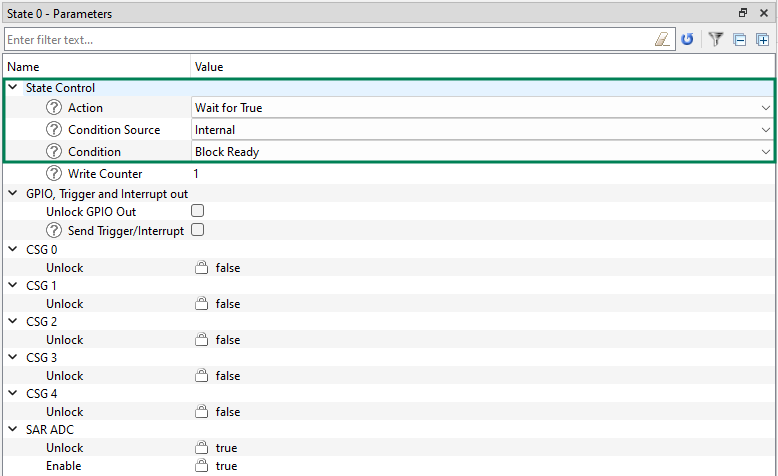
        
    - Under **State 1**: 
        - **Action**: Stop (reset peripheral to State 0);
        - **Send Trigger/Interrupt**: Checked (send trigger upon entering state);
        - **Group 0 Trigger**: Checked (trigger is sent to **Group 0**);
    - 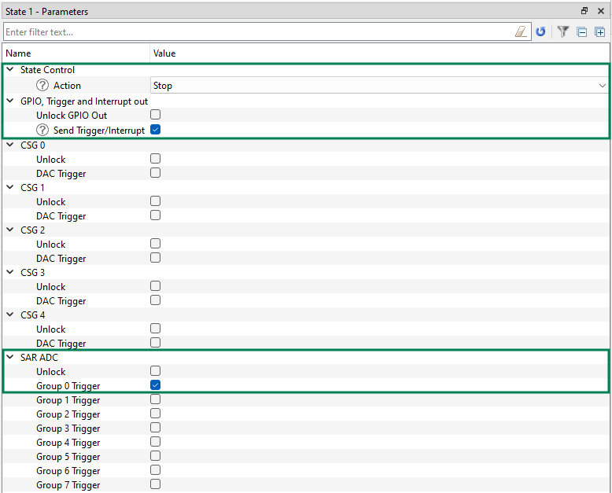
1. Under **Input Triggers**, check **Trigger 0** and set **Trigger Source** to **Firmware Pulse**;
1. Select and enable **SAR**, check the **Channel ID** setting;
    - This setting will include the Channel ID in the ADC conversion result;
    - 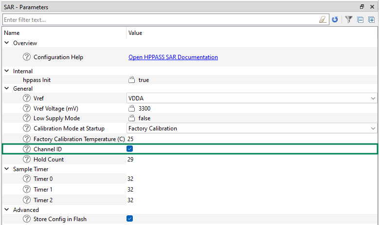
1. Under **FIFO**, select and enable **Buffer 0**:
    - **Level**: 2 (threshold number of elements to trigger the output connection);
    - **Trigger Output**: DMA DataWire 0 Channel 0 (After two elements are in the FIFO, trigger DMA transfer on Channel 0);
    - 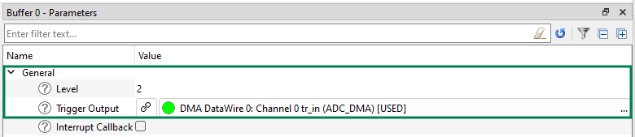
1. Under **Samplers -> Direct**, select and enable **Sampler 0, 1, 2 and 3**;
1. For each of the **Samplers**, select and enable the channel associated with it (renaming recommended);
    - 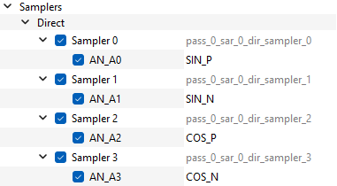
1. Under the **AN_A0** channel:
    - **Pseudo-Differential Enable**: Checked (will internally configure AN_A0 and AN_A1 as differential pair);
    - **Result Format**: Signed (up to personal preference, **Signed** makes data interpretation easier in this case);
    - **FIFO**: FIFO0 (send conversion result to **Buffer 0/FIFO0**);
    - 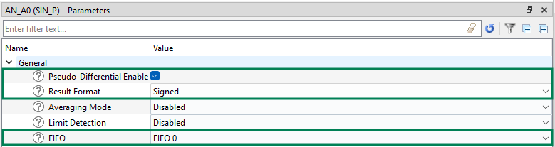
1. **Repeat the same configuration for AN_A2 channel**;
1. Under **Sequencer**, select and enable **Group 0*0, using the **SAR Sequencer Group-1.0 personality**:
    - **Sampler 0**: Checked (add the AN_A0-AN_A1 pair to conversion sequence);
    - **Sampler 2**: Checked (add the AN_A2-AN_A3 pair to conversion sequence);
    - **Input Trigger**: Trigger 0 (the trigger sent by AC State 1);
    - 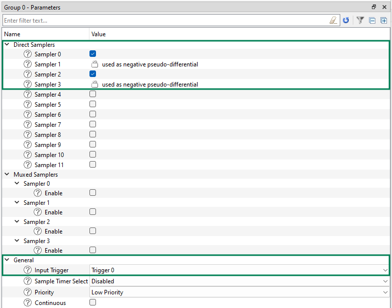

Final list of enabled settings in the **Analog** tab: <br>
- 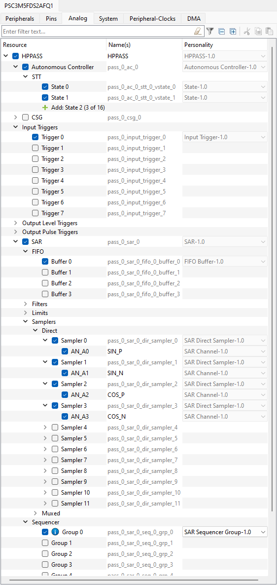

</details>

<br>

<details><summary><b>DMA</b></summary>

1. Select the **DMA** tab of the **Device Configurator**;
1. Under **DMA DataWire 0**, select and enable **Channel 0**;
    - **Trigger Input**: Buffer 0 tr_fifo_level_out (HPPASS SAR Buffer 0 trigger output);
    - **Number of Descriptors**: 1;
    - **Trigger output**: Trigger on descriptor completion;
    - **Interrupt type**: Trigger on descriptor completion;
    - **Enable Chaining**: Checked (in case another descriptor is used);
    - **Trigger input type**: An entire descriptor transfer per trigger;
    - **Trigger reactivation and retriggering**: Wait for trigger reactivation;
    - Under **Descriptor X loop settings**:
        - **Number of data elements to transfer**: 2 (both pseudo-differential conversion results);
        - **Source increment every cycle by**: 0 (FIFO reads from the same location);
        - **Destination increment every cycle by**: 1 (the two array elements);
        - **CRC**: don't care;
    - Under **Descriptor Y loop settings**:
        - Number of X-loops to execute: 1 (array has only one dimension);
        - **Source increment every cycle by**: 0;
        - **Destination increment every cycle by**: 0;
    - 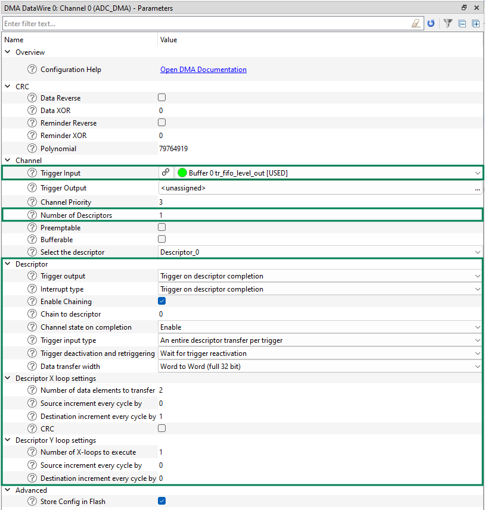

</details>

<br>

### 2.4. Firmware

This chapter provides insight into the firmware structure and program flow.

<br>

#### 2.4.1. Library Organization

Inside the project, the folder `src` houses all the functionalities of this example code:
- `MCU` folder contains all the microcontroller-specific initialization and peripheral functions;
    - `ADC` folder contains the HPPASS configuration and ADC measurement handling;
    - `DMA` folder contains the DMA interrupt configuration;
    - `UART` folder contains the UART HAL initialization and serial port data formatting and transmission functions.
- `Sensor` folder contains TLE5501-specific functions, such as angle extrapolation from SIN/COS components.

<br>

#### 2.4.2. Initialization

At the beginning of the program, the function 'cybsp_init()' initializes the peripherals with the settings applied in **Device Configurator**, particularly focusing on hardware connections. <br>
This function is present by default upon creating a new project using the ModusToolbox&trade; toolchain and the official Board Support Packages (BSP's).

For further setup, the function `PSC3M5_MCU_Init()` handles firmware aspects of MCU initialization and encapsulates the following:
- `PSC3M5_UART_Init()`: Initializes the UART Hardware Abstraction Layer (HAL), so information can be sent to the serial port using the `printf()` function in `stdio.h`;
- `PSC3M5_ADC_Init()`: Starts the HPPASS peripheral (HPPASS is configured, but not started by default;
- `PSC3M5_DMA_Init()`: Configures the data transfer target array and the interrupt that triggers after a DMA data transfer.

After these operations, global interrupts are enabled with the `__enable_irq()` function.

<br>

#### 2.4.3. Data Structures

This example code uses the `TLE5501_t` structure to cluster information about the sensor:

```c
typedef struct {
    // ADC readings
    int16_t SIN_DIFF_ADC;
    int16_t COS_DIFF_ADC;
    
    // LSB -> rad
    double  SIN_RAD;
    double  COS_RAD;

    // Extrapolated angle
    double  ANGLE
} TLE5501_t;
```

A global struct `sensor` is declared inside the `TLE5501_0002.h` file, that can be passed as `&sensor` to all the available functions. 

<br>

#### 2.4.4. Available Functions

This chapter provides a list of the functions available in this example code.

**void PSC3M5_MCU_Init(void)**
> This function fully initializes and starts the peripherals of the PSOC&trade; Control C3M microcontroller, as described in Section 2.4.1. <br>
> Call at the beginning of the program.

<br>

**void PSC3M5_ADC_TriggerMeasurement(void);**
> This function triggers the HPPASS conversion sequence. <br>
> The DMA interrupt flag is polled, until a transfer is detected. <br>
> If DMA transfer was successful, resume program execution.

<br>

**void PSC3M5_UART_SendAngleInfo(TLE5501_t\* sensor);**
> This function displays on the serial port:
> - The SIN angle component, in radians [-PI : PI];
> - The COS angle component, in radians [-PI : PI];
> - The extrapolated angle value, in degrees [0 : 360]; 
>
> `TLE5501_t\* sensor` - sensor struct from which data is extracted.

<br>

**void TLE5501_GetAngle(TLE5501_t\* sensor)**
> This function extracts the ADC readings from the DMA and populates the entire `sensor` struct. <br>
> SIN and COS [rad] are computed from the ADC conversion results. <br>
> Angle [rad] is computed from the SIN and COS components. <br>
> Angle [deg] is converted from radians, with an addition shift from [-180 : 180] to [0 : 360]. <br>
> `TLE5501_t\* sensor` - sensor struct to which the angle information is sent.

<br>

### 2.5. Implementation Example

This section provides the code for ~20Hz continuous readout of the TLE5501 TMR angle sensor on the PSOC&trade; Control C3M5 Motor Drive Control Card. <br>
Angle information (SIN [rad], COS [rad], ANGLE [deg]) can be visualized using any serial port monitor, like hterm or Tera Term.

<br>

```c

#include "cy_syslib.h"
#include "mtb_hal.h"
#include "cybsp.h"

#include "src/MCU/PSC3M5.h"
#include "src/Sensor/TLE5501_0002.h"
#include <stdio.h>


/*******************************************************************************
* Function Name: main
********************************************************************************
* Summary:
* This function provides continuous readout of the TLE5501 E0002 TMR angle sensor.
* Peripherals are configured using the BSP-proprietary function, cybsp_init().
* Interrupt configuration for ADC and DMA is done in the PSC3M5_MCU_Init() function.
*
* Parameters:
*  void
*
* Return:
*  int
*
*******************************************************************************/
int main(void)
{
    cy_rslt_t result;

    // Initialize the device and board peripherals
    result = cybsp_init();

    // Board init failed. Stop program execution
    if (result != CY_RSLT_SUCCESS)
    {
        CY_ASSERT(0);
    }
    
    // Initialize interrupts and start peripherals
    PSC3M5_MCU_Init();

    /* Enable global interrupts */
    __enable_irq();

    for (;;)
    {
		// Trigger ADC conversion and wait for DMA transfer
		PSC3M5_ADC_TriggerMeasurement();
		
		// Extract data and compute angle
		TLE5501_GetAngle(&sensor);
		
		// Print to serial port
		PSC3M5_UART_SendAngleInfo(&sensor);
		
		// ~20Hz continuous readout
		Cy_SysLib_Delay(50);
    }
}

```