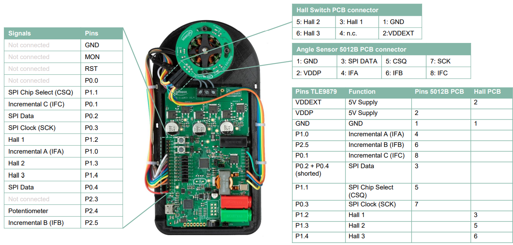
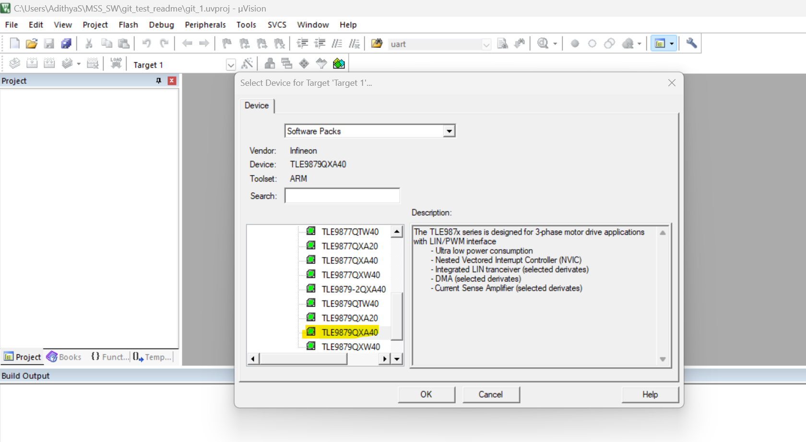
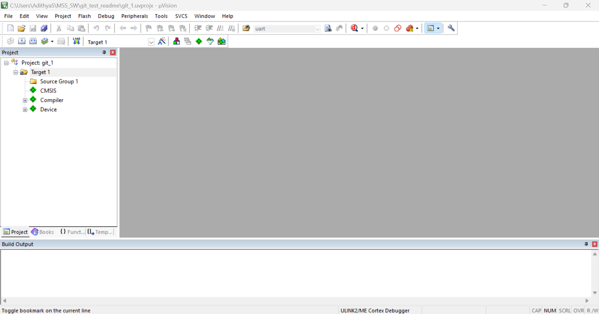
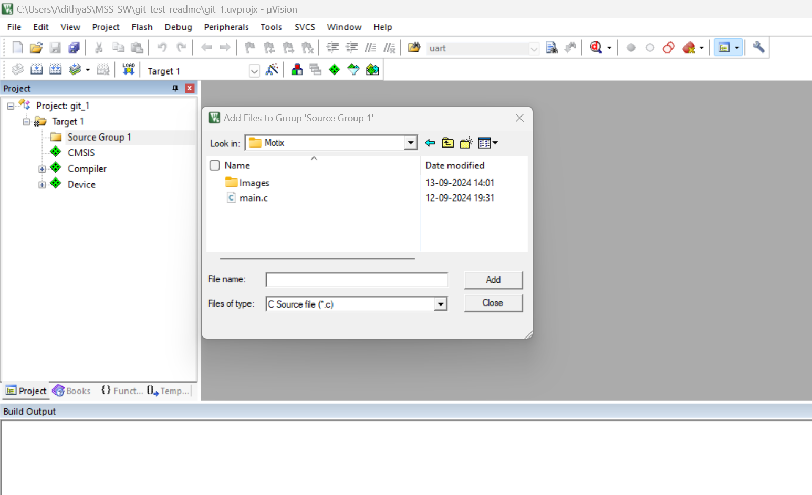
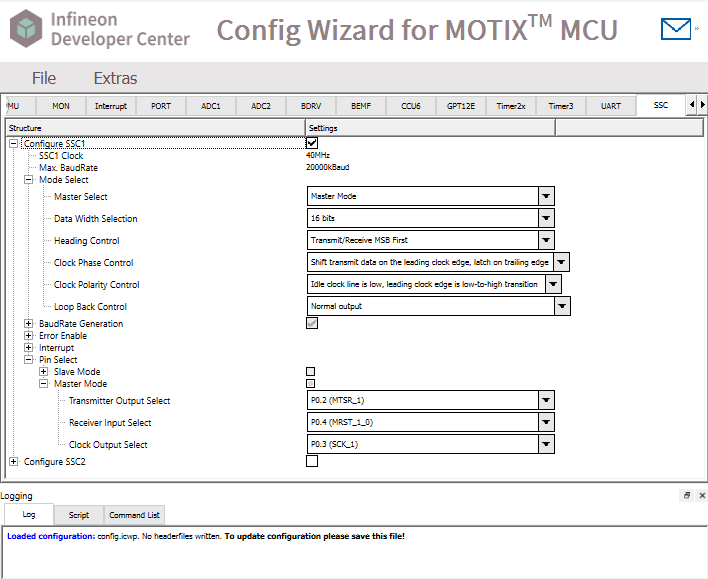
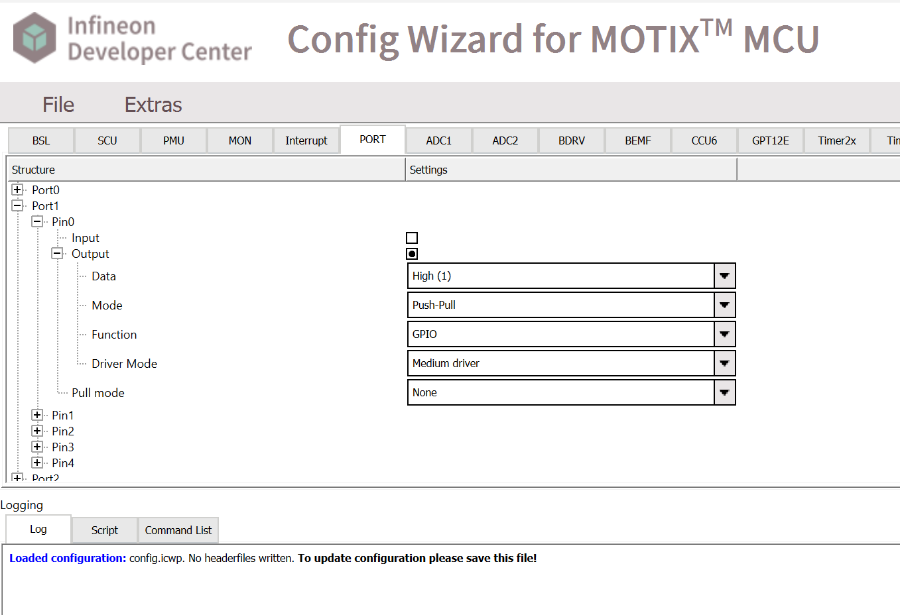

# MOTIX: TLE5012B Angle Sensor interfacing with TLE9879 Motix Controller and using angle sensor for steering angle measurement

This code example demonstrates how to interface [TLE5012B](https://www.infineon.com/cms/en/product/sensor/magnetic-sensors/magnetic-position-sensors/angle-sensors/tle5012b-e1000/) angle sensor with [TLE9879](https://www.infineon.com/cms/en/product/sensor/magnetic-sensors/magnetic-position-sensors/angle-sensors/tle5012b-e1000/) Motix Controller and also use the sensor for steering angle position measurement. The sensor is interfaced with the controller via SSC (3-wire SPI) interface. The controller is the master which initiates the communication using sending command to retrieve angle information. The sensor which the slave, upon receiving the appropriate command from the master sends the angle information on the data lines.

This setup is implemented using the Keil IDE and Tera Term for UART communication, providing real-time angle monitoring and accurate angle value being displayed on the terminal.

[View this README on GitHub.](replace_code_example_github_readme_url)

## Requirements

- Keil uVision5 IDE
- Programming language: C
- [TLE5012B](https://www.infineon.com/cms/en/product/sensor/magnetic-sensors/magnetic-position-sensors/angle-sensors/tle5012b-e1000/)
- [TLE9879](https://www.infineon.com/cms/en/product/sensor/magnetic-sensors/magnetic-position-sensors/angle-sensors/tle5012b-e1000/)

## Supported kits (make variable 'TARGET')

- [MOTORCONTROLKIT_12V](https://www.infineon.com/cms/en/product/evaluation-boards/motorcontrolkit_12v/)

## Hardware setup

This example uses the board's default configuration. See the kit user guide to ensure that the board is configured correctly.

Use jumper wires to establish a connection between TLE5012B Angle sensor and the MOTORCONTROL_12V kit as mentioned below.

1. Connect **VCC** of the sensor to the **3.3V** supply on the MOTORCONTROLKIT_12V kit.
2. Connect the **GND** pin of the sensor to the **GND** of the MOTORCONTROLKIT_12V kit.
3. Connect the Clock pin (SCK) **Pin 7** of the sensor to  **P0.3** of the MOTORCONTROLKIT_12V kit.
4. Connect the Chip select (CSQ) **Pin 5** of the sensor to  **P1.1**
5. Connect the SPI DATA pin (DATA) **Pin 3** of the sensor to 

Refer to the Motorcontrol Kit.

   **Figure 2. Connection Pin out of between MOTORCONTROLKIT_12V**
   
   

## Software setup

**Step 1**: Install Keil uVision5 IDE.

**Step 2**: Install a terminal emulator if you don't have one. Instructions in this document use [Tera Term](https://teratermproject.github.io/index-en.html).

**Step 3**: Open uVision, Click on **project**, then click on **New uVision project** and select destination of project and then target selection window pops up. 

**Step 4**: Inside target selection, select the target controller.

**Step 5**: Select Run-Time Environment dependencies. Select the dependenices shown with tick marks.

**Step 6**: After selecting dependies, project will be created and files will be available at in project window. 

**Step 7**: Add the main file to the existing project. 

**Step 8**: Build, Compile, Flash and Execute the code. 

## Operation

1. Connect the board to your PC using the provided USB cable through the KitProg3 USB connector.

2. Supply 12 V to the MOTORCONTROLKIT board.
    
3. Using Config Wizard for Motix MCU configure the SSC and GPIO peripherals.

4. Configuring SSC:

   a) Select **SSC** 1 block.
  
   b) Select mode of SSC to **Master Mode**.

   c) Select Data Width as **16 bits**.

   d) Select  Transmission with **MSB First**.

   e) CLock Phase: **Shift data on the leading clock edge, latch on trailing edge**.

   f) Clock Polarity: **Idle clock line is low, leading clock edfe is low to high transmission** 

   g) Pins: Clock = **P0.3**, MOSI = **P0.2**, MISO = **P0.4**

   

5) Configuring GPIO for Chip Select.

   a) Configure PORT 1 Pin4 as output. This pins will be used as slave select.

   

6) Open the terminal and select baud rate to 115200.

7) Flash the code into the controller and the real time angle value will be visible on the terminal.

   
   

## Related resources

Resources  | Links
-----------|----------------------------------
Device documentation | [TLE5012B Datasheet](https://www.infineon.com/dgdl/Infineon-TLE5012B_Exxxx-DataSheet-v02_01-EN.pdf?fileId=db3a304334fac4c601350f31c43c433f)   [TLE5012B UserManual](https://www.infineon.com/dgdl/Infineon-Angle_Sensor_TLE5012B-UM-v01_02-en-UserManual-v01_02-EN.pdf?fileId=5546d46146d18cb40146ec2eeae4633b&da=t)  [TLE5012B Product Page](https://www.infineon.com/cms/en/product/sensor/magnetic-sensors/magnetic-position-sensors/angle-sensors/tle5012b-e1000/)  [TLE9879 datasheet](https://www.infineon.com/dgdl/Infineon-TLE9879QXA40-DataSheet-v02_11-EN.pdf?fileId=8ac78c8c81ae03fc0181d840096a3c2f)
Development kits | Select your kits from the [Evaluation board finder](https://www.infineon.com/cms/en/design-support/finder-selection-tools/product-finder/evaluation-board).
Tools  | Keil uVision5

 

## Other resources

Infineon provides a wealth of data at [www.infineon.com](https://www.infineon.com) to help you select the right device, and quickly and effectively integrate it into your design.

