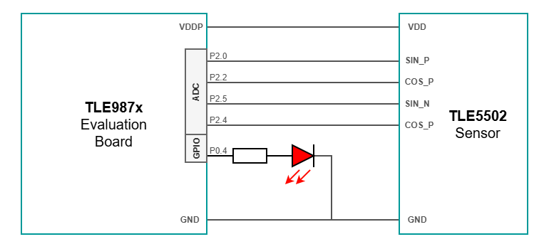
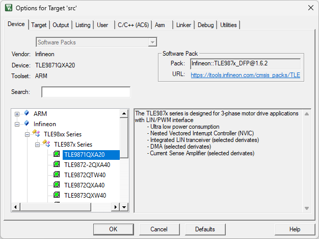
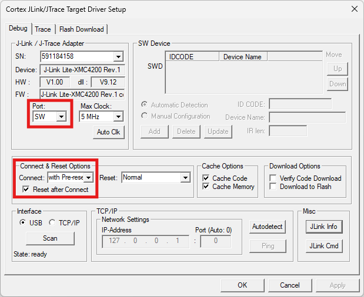
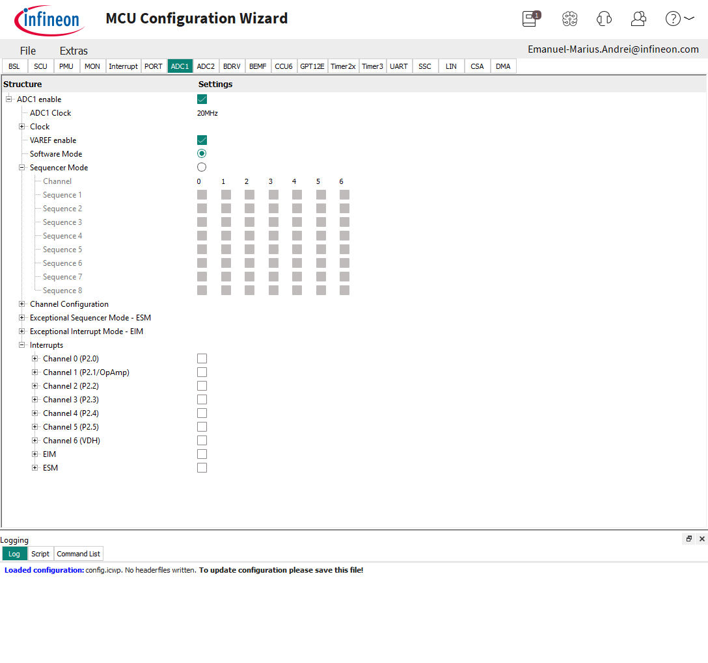
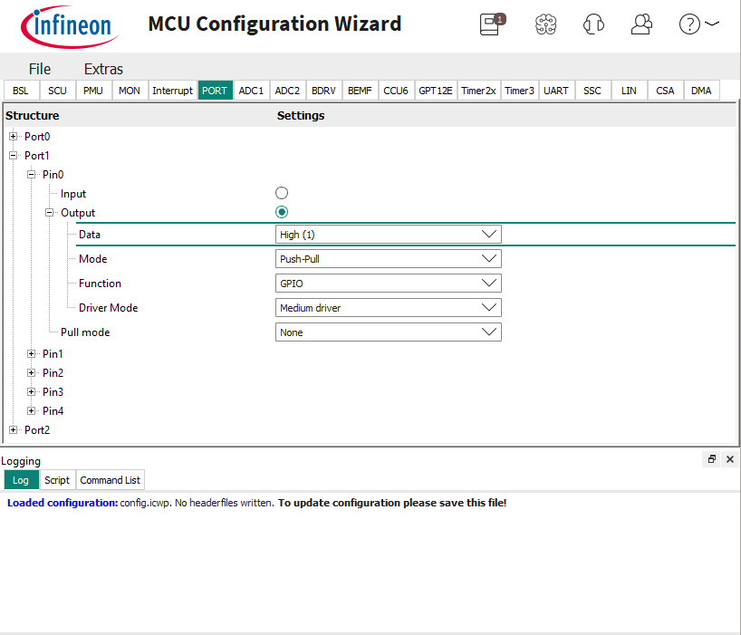

# TLE5502 TLE987x Integration Example

<br>

## 1. Introduction

This code example provides a starting point for interfacing the TLE5502 angle sensor with a microcontroller from the MOTIX&trade; TLE987x family, using the on-chip **ADC1** measurement unit. <br>
The TLE5502 is an analog output sensor: it does not expose a digital interface, but provides two differential signal pairs (sine and cosine) that must be sampled by the microcontroller and converted into an angle. <br>
The development boards used for this example code are:
- **TLE5502 Satellite Board**;
- **TLE987x EvalBoard**, VQFN socket:
    - TLE9871QXA20 microcontroller;
    - TLE9872QXA40 microcontroller;
    - [Evaluation Board Infineon website](https://www.infineon.com/evaluation-board/TLE987X-EVALB-VQFN)

> Note: <br>
> The **TLE9879 EvalKit V1.4** is not supported by this example code. <br>
> The analog input pins required for this configuration (P2.0, P2.2, P2.4 and P2.5) are not all freely available on that kit, so only the **TLE987x VQFN EvalBoard** can be used.

### 1.1. Short description

This example code performs continuous readouts of the four TLE5502 analog outputs via ADC1, at a frequency of ~20Hz.<br>
All four channels are acquired in a single ADC sequence, so that the sine and cosine samples belong to the same sweep and the decoded angle is coherent.<br>
The angle is then computed from the two differential signals using `atan2f()`.<br>
For easier interpretation and visualization, the following data is transmitted to the serial port:
- The four measured channel voltages (SinP, CosP, SinN, CosN), in volts;
- Calculated angle value, in degrees;

Additionally, the P0.4 LED is toggled once per readout (~20Hz toggle rate), giving a visual 10Hz blink as a data indication.<br>

Peripheral configuration is detailed in **Section 3**. <br>

>Note: The provided example is not a qualified solution and is provided "as-is".

<br>

## 2. Getting started

### 2.1. Hardware connections

The block diagram below shows the required connections between the TLE5502 angle sensor and the TLE987x VQFN EvalBoard.<br>
The four sensor outputs are routed to the analog-capable pins of Port 2, as summarized in the table below:

| TLE5502 output | TLE987x pin | ADC1 channel |
| :------------- | :---------- | :----------- |
| SIN_P          | P2.0        | CH0          |
| COS_P          | P2.2        | CH2          |
| COS_N          | P2.4        | CH4          |
| SIN_N          | P2.5        | CH5          |

In addition:
- **P0.4** drives the on-board LED used as data indication;
- **P1.1 (TxD2)** is connected to the on-board debugger and carries the serial output to the PC.

Additional components, such as **decoupling capacitors** and the **load resistors** required by the sensor current-output stage, are not depicted. **Please refer to the TLE5502 datasheet for more details!** <br>



### 2.2. Necessary software

In order to access all the features of the code example, the following software is required:
- **Keil µVision5 IDE**, version 5.43.1.0. 
    - IDE of choice for this example code, as it is compatible with the TLE987x microcontroller family.
    - For more details about the software, check the [official Keil MDK-ARM v5.xx website](https://www.keil.com/demo/eval/arm.htm).
- **Infineon MCU Config Wizard V2.7.6**, for peripheral configuration.
    - This tool is free to download for users with a myInfineon account. 
    - Find the software on the **Infineon Development Center (IDC) Launcher**, or [online](https://softwaretools.infineon.com/assets/com.ifx.tb.tool.ifxconfigwizardforembeddedpowerics).

> Note: <br>
> In case the example code flashes correctly, but the serial port does not display any information, make sure to update the J-Link driver of the on-board debugger using the **J-Link Commander**. <br>

### 2.3. Project importing in Keil µVision5

Once installed, the example code project can be imported onto your machine:
1. Create a new folder that will act as your Keil µVision5 workspace;
1. Inside the created folder, right click, Git Bash Here, clone the code example repository;
1. Project can be opened directly, by double-clicking the `TLE5502_TLE987x_IntegrationExample.uvprojx` file, or by opening the Keil µVision5 IDE and selecting **Project > Open Project** from the toolbar.

### 2.4. DFP installation in Keil µVision5

In case it is the first time using the MOTIX&trade; TLE987x microcontroller family, make sure to install the **Infineon TLE987x_DFP** support package:<br>
1. Go to the toolbar and select **Project > Manage > Pack Installer**;
1. On the left side, in the **Devices** tab, search for `TLE987x`;
1. On the right side, select the `Infineon TLE987x_DFP` package and click **Install**;


### 2.5. Debugger configuration

To correctly configure the debugger for your target microcontroller, follow the steps below:
1. Go to the toolbar and select **Project > Options for Target 'src'**;
1. In the new window, select the **Device** tab and select your target microcontroller;
    - TLE9871QXA20;
    - TLE9872QXA40;

    

1. Select the **Debug** tab and select from the top-right dropdown menu the **J-LINK / J-TRACE Cortex** debugger;

    

1. Press the **Settings** button, a new window will appear:
    - In the **J-Link / J-Trace Adapter** section, **Port** menu, select **SW** (default is JTAG);
    - In the **Connect & Reset Options** section, **Connect** menu, select **with Pre-reset** (default is Normal);

    

1. Press **OK** to close the window and **OK** again to close the Options window.
1. Build the project by selecting **Project > Build Target** or pressing **F7**.

### 2.6. Flashing the firmware

Power the TLE987x evaluation board (12V) and connect it to the PC using a micro-USB cable.<br>
In order to flash the firmware, the project must be built first, as the IDE does not automatically build before flashing.<br>
After flashing, power cycle the board, or press the on-board RESET button.

<br>

## 3. Peripheral configuration

This chapter represents a rundown of the configuration done in the **MCU Config Wizard** for the peripherals used in the example code, and can be used as a reference or for configuring a new project:
- **ADC1**, for measuring the analog outputs of the sensor;
- **PORT**, for GPIO configuration of the data indication LED and of the analog input pins;
- **UART2**, for UART communication with the PC.

To open the MCU Configuration Wizard, go to the toolbar and select **Tools > MCU Config Wizard V2.7.6**.<br>
In case the option is not available, restart the Keil µVision5 IDE and try again.<br>

> Note: <br>
> The Wizard only sets up the static part of ADC1 (pin usage and power-up defaults). <br>
> The acquisition-specific settings (sequence membership, sample time, resolution and result handling) are applied at runtime by `ADC_Init_SinCos()`, so that the four channels are guaranteed to be sampled coherently. Both parts are described below.

<br>

<details><summary><b>ADC1</b></summary>

1. Select the **ADC1** tab of the **MCU Config Wizard**;
1. Check the box on the **ADC1 enable** line to enable the peripheral;

The measurement behaviour is then completed in firmware, in `ADC_Init_SinCos()`:

```c
ADC1_Power_On();
ADC1_ANON_Set((uint32)ADC1_ANON_NORMAL);           /* analog front-end always-on mode */

while (ADC1_ANON_Sts() != ADC1_ANON_NORMAL)
{
  /* wait for the analog part to reach normal mode */
}

ADC1_DIVA_Set(1u);                                 /* analog clock divider */

/* All four sin/cos channels in ONE sequence => one uninterrupted sweep. */
ADC1_Sequence0_Set(ADC1_MASK_P20 | ADC1_MASK_P22 |
                   ADC1_MASK_P24 | ADC1_MASK_P25);

/* Identical sample time on every channel keeps the four readings comparable */
ADC1_Ch0_Sample_Time_Set(ADC_SAMPLE_TICKS);
ADC1_Ch2_Sample_Time_Set(ADC_SAMPLE_TICKS);
ADC1_Ch4_Sample_Time_Set(ADC_SAMPLE_TICKS);
ADC1_Ch5_Sample_Time_Set(ADC_SAMPLE_TICKS);

/* 10-bit resolution on all channels */
ADC1_Ch0_DataWidth_10bit_Set();
ADC1_Ch2_DataWidth_10bit_Set();
ADC1_Ch4_DataWidth_10bit_Set();
ADC1_Ch5_DataWidth_10bit_Set();

/* Wait-For-Read: a valid result is not overwritten until it is read. */
ADC1_Ch0_WaitForRead_Set();
ADC1_Ch2_WaitForRead_Set();
ADC1_Ch4_WaitForRead_Set();
ADC1_Ch5_WaitForRead_Set();

ADC1_Sequencer_Mode_Sel();                         /* start sequencer-driven conversions */
```



> Note: <br>
> Placing all four channels in **Sequence 0** means they are converted one after another in a single, uninterrupted sweep. This keeps the sine and cosine samples time-aligned, which is mandatory for a correct `atan2f()` result. <br>
> **Wait-For-Read** must be used instead of the Overwrite mode: in Overwrite mode a fast sequencer could replace the CH0 result while CH5 is still being fetched, producing a torn sample set and a corrupted angle. <br>
> The sample time is set to 20 ticks per channel. The TLE5502 outputs are relatively high impedance and share one sample & hold through the input multiplexer, so a shorter sample time causes channel-to-channel crosstalk.

</details>

<details><summary><b>PORT</b></summary>

1. Select the **PORT** tab of the **MCU Config Wizard**;
1. Under **Port0 > Pin4 > Output**, configure the data indication LED:
    - **Data**: Low (0)
    - **Mode**: Push-Pull
    - **Function**: GPIO
    - **Driver Mode**: Medium driver
1. Under **Port2**, make sure that pins **Pin0**, **Pin2**, **Pin4** and **Pin5** are set as **Analog input**

The LED pin is addressed in firmware through the GPIO abstraction layer, using a single macro that bundles the port register, bit position and bit mask:

```c
#define BLINK_PIN_PORT	&PORT->P0_DATA.reg
#define BLINK_PIN_Pos	(uint8)PORT_P0_DATA_P4_Pos
#define BLINK_PIN_Msk	(uint8)PORT_P0_DATA_P4_Msk
#define BLINK_PIN		BLINK_PIN_PORT, BLINK_PIN_Pos, BLINK_PIN_Msk

GPIO_TogglePin(BLINK_PIN);
```


</details>

<details><summary><b>UART2</b></summary>

1. Select the **UART** tab of the **MCU Config Wizard**;
1. Check the box on the **Configure UART2** line to start configuring the peripheral;
1. Under **Baudrate**:
    - **Automatic BaudRate Configuration**: Enabled
    - **BaudRate**: 115200
1. Under **Mode**:
    - **Mode Select**: Mode 1: 8-bit UART, variable baudrate
    - **don't set Receive Interrupt if no StopBit was Received (SM2)**: Disabled
    - **Receiver enabled**: Disabled
    - **STDIN/STDOUT enabled**: Enabled
1. Under **Pin Select**:
    - **TxD Pin Select**: TxD2 (P1.1)
    - **RxD Pin Select**: RxD2_0 (P1.2)

> Note: <br>
> The receiver is disabled, as the example only transmits data. The RxD pin is still selected because the Wizard requires a valid pin assignment for UART2.


</details>

<br>

## 4. Firmware

This chapter provides insight into the firmware structure and program flow. <br>

### 4.1. Library organization

The Keil µVision5 IDE does not allow for multi-layer folder hierarchy, so the file explorer inside the IDE does not reflect the actual folder structure of the project. <br> 

Inside the project, the folder `src` houses all the functionalities of this example code:
- `Controller` folder contains all the microcontroller-specific and peripheral functions:
    - `TLE987x_ADC` folder contains the ADC1 initialization sequence, the `Measurement_t` result structure and the low-level multi-channel sampling function;
    - `TLE987x_UART` folder contains `TLE987x_UART.h`, with the UART serial port data formatting/transmission function;
    - `TLE987x_GPIO` folder contains GPIO abstraction functions used for the data indication LED;
- `Sensor` folder contains TLE5502-specific information:
    - `TLE5502.c/h` contain definitions particular to the sensor, the `TLE5502_t` data structure, the channel-to-signal mapping macros and the angle decoding routine;
    - `Interface` folder contains `ADC.c/h`, which pull in the microcontroller ADC abstraction used by the sensor layer.

### 4.2. Initialization

At the beginning of the program, the function `TLE_Init()` initializes the peripherals with the settings applied in **MCU Config Wizard**, particularly focusing on hardware connections.<br>
This function is present by default upon creating a new project using the Keil µVision5 toolchain and the official DFP's.<br>
It is followed by `ADC_Init_SinCos()`, which applies the acquisition settings that are not covered by the Wizard. The TLE5502 sensor itself is a purely analog device and requires no initialization sequence.

### 4.3. Data structure

The sensor layer exposes all its data through a single structure, `TLE5502_t`, defined in `TLE5502.h`:

```c
//--------------------------------------------------------//
//---------------------- Structures ----------------------//
//--------------------------------------------------------//
typedef struct TLE5502
{
  uint16 SIN_P_mV;
  uint16 SIN_N_mV;
  uint16 COS_P_mV;
  uint16 COS_N_mV;
  float  ANGLE_DEG;   /* VALID is set true when data is sampled sequentially	*/
  bool   VALID;
} TLE5502_t;
```

| Field | Type | Description |
| :---- | :--- | :---------- |
| `SIN_P_mV` | `uint16` | Positive sine channel voltage, in millivolts (P2.0 / ADC1 CH0) |
| `SIN_N_mV` | `uint16` | Negative sine channel voltage, in millivolts (P2.5 / ADC1 CH5) |
| `COS_P_mV` | `uint16` | Positive cosine channel voltage, in millivolts (P2.2 / ADC1 CH2) |
| `COS_N_mV` | `uint16` | Negative cosine channel voltage, in millivolts (P2.4 / ADC1 CH4) |
| `ANGLE_DEG` | `float` | Decoded shaft angle, in degrees, normalized to the [0, 360) range |
| `VALID` | `bool` | `true` only when all four channels were sampled coherently in the same ADC sequence |

The structure is filled by `TLE5502_GetAngleAndVoltage()`, which returns one complete snapshot of the sensor per call.<br>
The `VALID` flag reflects the result of `ADC_SampleAll()`: it is `true` only when the four voltages belong to the same, uninterrupted sweep. If a channel result was missing or stale, the sample set is torn and `ANGLE_DEG` is forced to `0.0f`.

> Note: <br>
> Always check `VALID` before using `ANGLE_DEG` or the channel voltages, otherwise a `0.0f` angle can be mistaken for a real 0&deg; position. <br>
> The voltages are stored in millivolts as integers to avoid unnecessary floating-point operations; convert them to volts only for display, as done in the example (`TLE5502_data.SIN_P_mV / 1000.0f`).

Typical usage:

```c
TLE5502_t TLE5502_data;
uint16 x, y;

TLE5502_data = TLE5502_GetAngleAndVoltage();

if (TLE5502_data.VALID)
{
    /* TLE5502_data.ANGLE_DEG holds a valid angle in [0, 360) */
    x = TLE5502_data.SIN_P_mV;  /* valid channel voltage in mV */
    y = TLE5502_data.COS_P_mV;  /* valid channel voltage in mV */
    // Rest of data processing...
}
```

<br>

### 4.4. Available functions

This chapter provides a list of the functions available in this example code.


**void ADC_Init_SinCos(void)**
> This function configures ADC1 for coherent sine/cosine acquisition. <br>
> The ADC is powered on and its analog front-end is set to always-on (normal) mode; the function blocks until this mode is effectively reached. <br>
> All four sensor channels are placed in **Sequence 0**, so that a single sweep produces one complete, time-aligned sample set. <br>
> Every channel receives the same sample time and 10-bit resolution, and is set to **Wait-For-Read**, so that a valid result is preserved until it is read. <br>
> Finally, the sequencer mode is selected, which starts continuous conversions. <br>
> Must be called at least once, after `TLE_Init()`.

<br>

**bool ADC_SampleAll(Measurement_t \*meas)**
> This function retrieves one complete set of ADC1 results, expressed in millivolts. <br>
> `Measurement_t *meas` - Destination structure; its fields are written even when the sample set is not valid. <br>
> Returns `true` when all four channels returned a fresh, valid result, and `false` when at least one of them did not. <br>
> Note: reading a channel result also clears its valid flag, so each flag is read exactly once inside this function and the flags must never be polled separately beforehand.

<br>

**TLE5502_t TLE5502_GetAngleAndVoltage(void)**
> This function samples the sensor and decodes the shaft angle. <br>
> A single call to `ADC_SampleAll()` is used, so that the four channel voltages are coherent, and the per-channel values are then mapped onto the sensor signal names through the `TLE5502_SIN_P`/`TLE5502_SIN_N`/`TLE5502_COS_P`/`TLE5502_COS_N` macros. <br>
> If the sample set is valid, the angle is computed; otherwise the angle is forced to `0.0f`, since a torn sample set would yield a meaningless result. <br>
> Returns a `TLE5502_t` structure containing the four channel voltages [mV], the decoded angle [degrees] and the `VALID` flag. <br>
> The `VALID` field should always be checked before using `ANGLE_DEG`.

<br>

**static float TLE5502_DecodeAngleDeg(uint16 sinP, uint16 sinN, uint16 cosP, uint16 cosN)**
> This internal function converts the differential sine/cosine channel readings into an angle in degrees. <br>
> The two differences `sinP - sinN` and `cosP - cosN` are computed first, which rejects the common-mode offset and noise shared by the two halves of each pair. <br>
> The angle is then obtained with `atan2f(-sinDiff, cosDiff)`; the sine term is negated to match the rotation direction of the sensor. <br>
> As `atan2f()` returns a value in the (-π, π] range, the result is converted to degrees and negative values are shifted by 360° to normalize the output to [0, 360). <br>
> Returns `float` angle value in degrees.

<br>

**void TLE987x_UART_SendVoltageAngleInfo(float sinP, float sinN, float cosP, float cosN, float angle_deg)**
> This function displays on the serial port one formatted data line, containing the four channel voltages [V] and the decoded angle [degrees]. <br>
> The positive channels are printed first, followed by the negative ones, so that the columns pair up on screen. <br>
> `float sinP`, `float sinN`, `float cosP`, `float cosN` - channel voltages, in volts. <br>
> `float angle_deg` - decoded angle, in degrees.

<br>

**void GPIO_TogglePin(volatile uint8 \*port, uint8 pin, uint8 msk)**
> This function inverts the output level of a GPIO pin, and is used to drive the data indication LED. <br>
> `volatile uint8 *port` - Pointer to the port data register. <br>
> `uint8 pin` - Bit position of the pin inside the register. <br>
> `uint8 msk` - Bit mask of the pin inside the register. <br>
> The companion functions `GPIO_SetOutputLevelLow()` and `GPIO_SetOutputLevelHigh()` take the same parameters and force the pin low, respectively high.

<br>

## 5. Implementation Example

This section provides the code for ~20Hz continuous readout of the TLE5502 angle sensor on the MOTIX&trade; microcontroller family. <br>
Channel voltages and angle information can be visualized using any serial port monitor, like hterm or Tera Term:
- **Baudrate**: 115200
- **Data bits**: 8
- **Stop bits**: 1
- **Parity**: none
- **Newline at**: CR

```c
/*******************************************************************************
* Header Files
*******************************************************************************/
#include "tle_device.h"
#include "eval_board.h"
#include <stdio.h>

#include "Controller/TLE987x_UART/TLE987x_UART.h"
#include "Controller/TLE987x_GPIO/TLE987x_GPIO.h"
#include "Sensor/TLE5502.h"


/*******************************************************************************
* Global variables
*******************************************************************************/
TLE5502_t TLE5502_data;				/* latest sensor snapshot: 4 channel voltages + angle */


/*******************************************************************************
* Function Name: main
********************************************************************************
* Summary:
* This function provides continuous readout of the TLE5502 angle sensor.
* Peripherals are configured using the PDL-proprietary function, TLE_Init().
*
*******************************************************************************/
int main(void)
{
	// Initialize TLE987x peripherals (clock, ports, UART, WDT1) as configured in the PDL
	TLE_Init();
	
	// Configure ADC1 sequence for the four differential sin/cos inputs
	ADC_Init_SinCos();
	
	while(1)
	{		
		// Service watchdog
		WDT1_Service();	
		
		// Sample all four channels and decode the mechanical angle
		TLE5502_data = TLE5502_GetAngleAndVoltage();
		
		
		// Send information to terminal
		TLE987x_UART_SendVoltageAngleInfo(TLE5502_data.SIN_P_mV / 1000.0f,
																			TLE5502_data.SIN_N_mV / 1000.0f,
																			TLE5502_data.COS_P_mV / 1000.0f,
																			TLE5502_data.COS_N_mV / 1000.0f,
																			TLE5502_data.ANGLE_DEG);
				
		// Toggles P0_4 LED once per loop as data indication @ 10Hz
		GPIO_TogglePin(BLINK_PIN);
		
		// ~14.25 ms for data decoding and UART transmission + 35.75 ms delay = 50 ms readout period (20Hz)
		Delay_us(35750);	
	}
}
```
Console output example, obtained while slowly rotating the magnet and then holding it still:
```console
| SinP: 3.025V | CosP: 3.132V | SinN: 1.950V | CosN: 2.072V | ANGLE: 314.60 [deg] |
| SinP: 3.025V | CosP: 2.639V | SinN: 1.955V | CosN: 2.072V | ANGLE: 297.92 [deg] |
| SinP: 3.167V | CosP: 2.434V | SinN: 1.818V | CosN: 2.336V | ANGLE: 274.16 [deg] |
| SinP: 3.186V | CosP: 2.434V | SinN: 1.852V | CosN: 2.526V | ANGLE: 266.05 [deg] |
| SinP: 3.010V | CosP: 2.209V | SinN: 1.974V | CosN: 2.942V | ANGLE: 234.72 [deg] |
| SinP: 3.010V | CosP: 1.881V | SinN: 1.974V | CosN: 2.942V | ANGLE: 224.32 [deg] |
| SinP: 2.834V | CosP: 1.886V | SinN: 2.160V | CosN: 3.093V | ANGLE: 209.18 [deg] |
| SinP: 2.595V | CosP: 1.813V | SinN: 2.394V | CosN: 3.176V | ANGLE: 188.39 [deg] |
| SinP: 2.336V | CosP: 1.813V | SinN: 2.644V | CosN: 3.172V | ANGLE: 167.23 [deg] |
| SinP: 2.111V | CosP: 1.920V | SinN: 2.878V | CosN: 3.064V | ANGLE: 146.16 [deg] |
| SinP: 1.940V | CosP: 2.253V | SinN: 3.054V | CosN: 2.917V | ANGLE: 120.80 [deg] |
| SinP: 1.837V | CosP: 2.487V | SinN: 3.137V | CosN: 2.737V | ANGLE: 100.89 [deg] |
| SinP: 1.837V | CosP: 2.482V | SinN: 3.157V | CosN: 2.267V | ANGLE:  80.75 [deg] |
| SinP: 1.837V | CosP: 2.903V | SinN: 3.147V | CosN: 2.272V | ANGLE:  64.28 [deg] |
| SinP: 1.925V | CosP: 2.898V | SinN: 3.040V | CosN: 2.077V | ANGLE:  53.63 [deg] |
| SinP: 2.013V | CosP: 2.996V | SinN: 2.971V | CosN: 1.999V | ANGLE:  43.86 [deg] |
| SinP: 2.331V | CosP: 3.059V | SinN: 2.639V | CosN: 1.813V | ANGLE:  13.88 [deg] |
| SinP: 2.326V | CosP: 3.176V | SinN: 2.639V | CosN: 1.818V | ANGLE:  12.98 [deg] |
| SinP: 2.390V | CosP: 3.172V | SinN: 2.585V | CosN: 1.803V | ANGLE:   8.11 [deg] |
| SinP: 2.390V | CosP: 3.181V | SinN: 2.585V | CosN: 1.798V | ANGLE:   8.03 [deg] |
| SinP: 2.390V | CosP: 3.176V | SinN: 2.590V | CosN: 1.803V | ANGLE:   8.29 [deg] |
| SinP: 2.375V | CosP: 3.172V | SinN: 2.595V | CosN: 1.808V | ANGLE:   9.16 [deg] |
| SinP: 2.385V | CosP: 3.186V | SinN: 2.600V | CosN: 1.813V | ANGLE:   8.90 [deg] |
| SinP: 2.375V | CosP: 3.186V | SinN: 2.590V | CosN: 1.808V | ANGLE:   8.87 [deg] |
| SinP: 2.385V | CosP: 3.176V | SinN: 2.595V | CosN: 1.803V | ANGLE:   8.70 [deg] |
| SinP: 2.380V | CosP: 3.176V | SinN: 2.600V | CosN: 1.813V | ANGLE:   9.17 [deg] |
| SinP: 2.380V | CosP: 3.181V | SinN: 2.595V | CosN: 1.808V | ANGLE:   8.90 [deg] |
| SinP: 2.385V | CosP: 3.181V | SinN: 2.600V | CosN: 1.808V | ANGLE:   8.90 [deg] |
| SinP: 2.380V | CosP: 3.181V | SinN: 2.600V | CosN: 1.813V | ANGLE:   9.14 [deg] |
| SinP: 2.380V | CosP: 3.181V | SinN: 2.605V | CosN: 1.813V | ANGLE:   9.34 [deg] |
| SinP: 2.380V | CosP: 3.176V | SinN: 2.595V | CosN: 1.808V | ANGLE:   8.93 [deg] |
| SinP: 2.385V | CosP: 3.181V | SinN: 2.595V | CosN: 1.803V | ANGLE:   8.66 [deg] |
| SinP: 2.380V | CosP: 3.167V | SinN: 2.600V | CosN: 1.808V | ANGLE:   9.20 [deg] |
```

