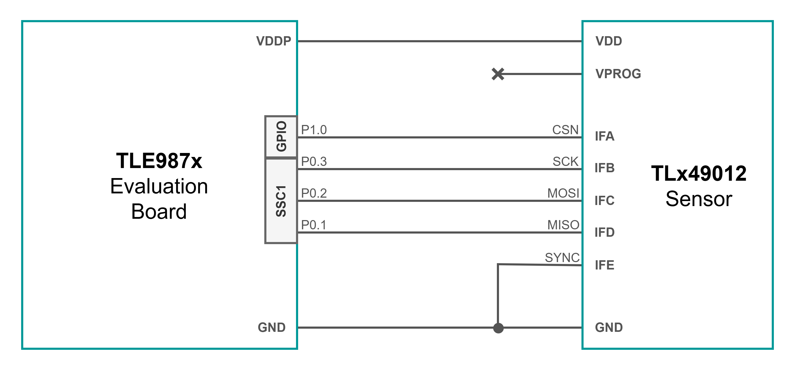
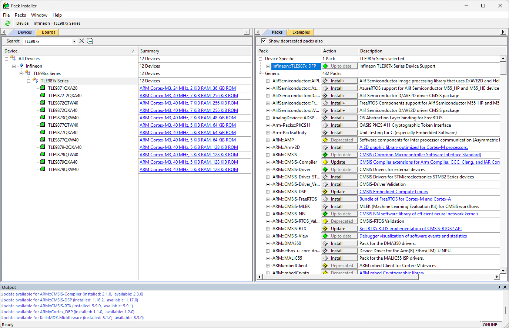
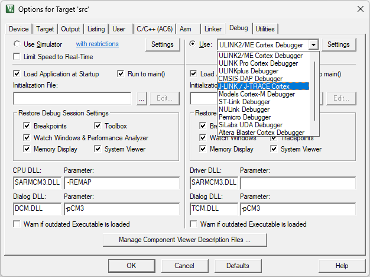
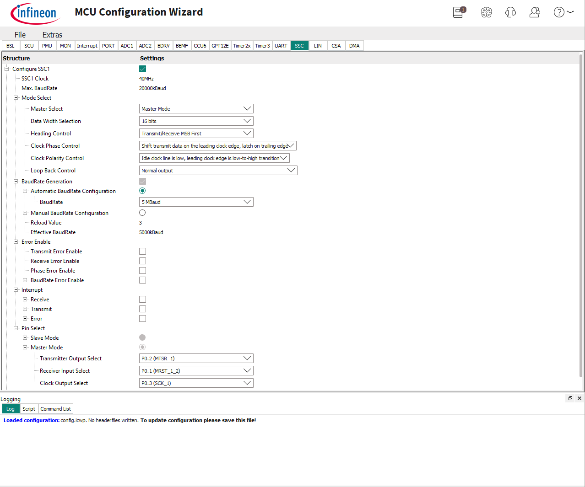
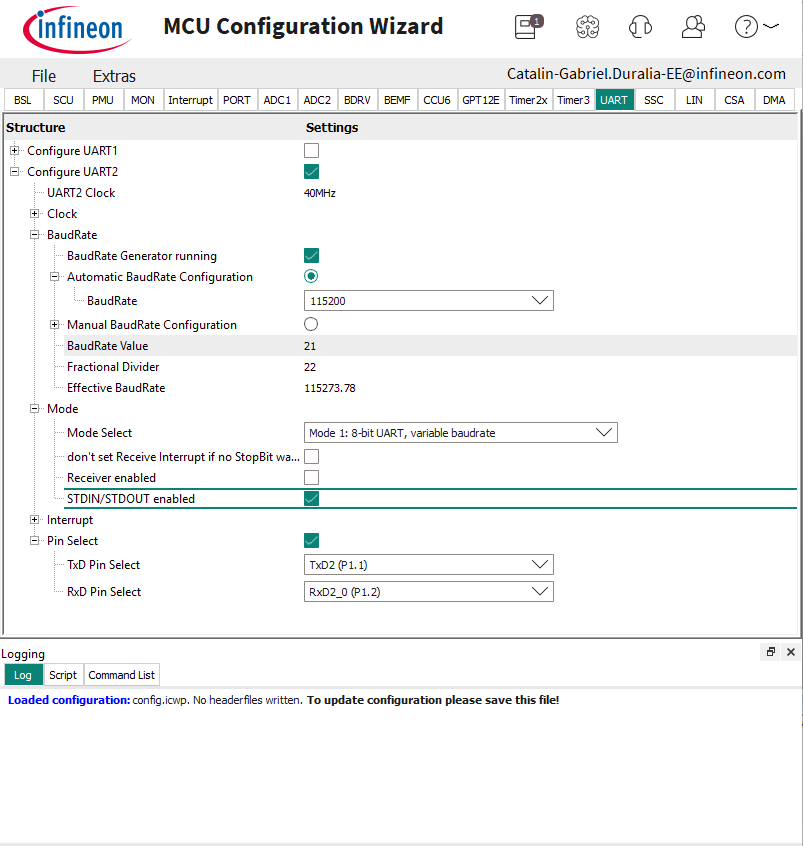

# TLx49012 TLE987x Integration Example

<br>

## 1. Introduction

This code example provides a starting point for interfacing the TLx49012 angle sensor with a microcontroller from the MOTIX&trade; TLE987x family, using **SPI**. <br>
The development boards used for this example code are:
- **TLE49012 Satellite Board**;
    - [Sensor Infineon website](https://www.infineon.com/part/TLE49012-S0001)
- **TLE987x EvalBoard**, VQFN socket:
    - TLE9871QXA20 microcontroller;
    - TLE9872QXA40 microcontroller;
    - [Evaluation Board Infineon website](https://www.infineon.com/evaluation-board/TLE987X-EVALB-VQFN)
- **TLE9879 EvalKit V1.4**:
    - TLE9879QXA40 microcontroller;    
    - [Evaluation Board Infineon website](https://www.infineon.com/evaluation-board/TLE9879-EVALKIT)

### 1.1. Short description

This example code performs continuous readouts of the TLx49012 angle sensor registers via SPI, at a frequency of ~20Hz.<br> 
SPI In-Frame addressing scheme is used and exemplified.<br>
For easier interpretation and visualization, the following data is transmitted to the serial port:
- Register angle value, in LSB;
- Calculated angle value, in degrees;

Peripheral configuration is detailed in **Section 3**. <br>

>Note: The provided example is not a qualified solution and is provided "as-is".

<br>

## 2. Getting started

### 2.1. Hardware connections

The block diagram below shows the required connections between the TLx49012 angle sensor and the TLE987x evaluation boards.<br>
Both TLE987x evaluation kits for development (TLE987x VQFN EvalBoard and TLE9879 EvalKit) have identical, labeled pin-outs.<br>
Additional components, such as **decoupling capacitors**, are not depicted. **Please refer to the [TLx49012 datasheet](https://www.infineon.com/assets/row/public/documents/24/49/infineon-tle49012-s0001-datasheet-en.pdf) for more details!** <br>



### 2.2 Necessary software

In order to access all the features of the code example, the following software is required:
- **Keil µVision5 IDE**, version 5.43.1.0. 
    - IDE of choice for this example code, as it is compatible with the TLE987x microcontroller family.
    - For more details about the software, check the [official Keil MDS-ARM v5.xx website](https://www.keil.com/demo/eval/arm.htm).
- **Infineon MCU Config Wizard V2.7.6**, for peripheral configuration.
    - This tool is free to download for users with a myInfineon account. 
    - Find the software on the **Infineon Development Center (IDC) Launcher**, or [online](https://softwaretools.infineon.com/assets/com.ifx.tb.tool.ifxconfigwizardforembeddedpowerics).
- In case the example code flashes correctly, but the serial port does not display any information, make sure to update the J-Link driver of the on-board debugger using the **J-Link Commander**. <br>

### 2.3. Project importing in Keil µVision5; 

Once installed, the example code project can be imported onto your machine:
1. Create a new folder that will act as your Keil µVision5 workspace;
1. Inside the created folder, right click, Git Bash Here, clone the code example repository;
1. Project can be opened directly, by double-clicking the `TLx49012_TLE987x_IntegrationExample.uvprojx` file, or by opening the Keil µVision5 IDE and selecting **Project > Open Project** from the toolbar.

### 2.4. DFP installation in Keil µVision5

In case it is the first time using the MOTIX&trade; TLE987x microcontroller family, make sure to install the **Infineon TLE987x_DFP** support package:<br>
1. Go to the toolbar and select **Project > Manage > Pack Installer**;
1. On the left side, in the **Devices** tab, seach for `TLE987x`;
1. On the right side, select the`Infineon TLE987x_DFP` package and click **Install**;



### 2.5. Debugger configuration

To correctly configure the debugger for your target microcontroller, follow the steps below:
1. Go to the toolbar and select **Project > Options for Target 'src'**;
1. In the new window, select the **Device** tab and select you target microcontroller;
    - TLE9871QXA20;
    - TLE9872QXA40;
    - TLE9879QXA40;

    

1. Select the **Debug** tab and select from the top-right dropdown menu the **J-LINK / J-TRACE Cortex** debugger;

    

1. Press the **Settings** button, a new window will appear:
    - In the **J-Link / J-Trace Adapter** section, **Port** menu, select **SW** (default is JTAG);
    - In the **Connect & Reset Options** section, **Connect** menu, select **with Pre-reset** (default is Normal);

    

1. Press **OK** to close the window and **OK** again to close the Options window.
1. Build the project by selecting **Project > Build Target** or pressing **F7**.

### 2.6. Flashing the firmware

Power the TLE987x evaluation board (12V) and connect it to the PC using a micro-USB cable.<br>
In order to flash the firmware, the project must be built first, as the IDE does not automatically build before flashing.<br>
After flashing, power cycle the board, or press the on-board RESET button.

<br>

## 3. Peripheral configuration

This chapter represents a rundown of the configuration done in the **MCU Config Wizard** for the peripherals used in the example code, and can be used as a reference or for configuring a new project:
- **SSC1**, for SPI communication with the sensor;
- **PORT**, for GPIO configuration of the SPI Chip Select pin;
- **UART2**, for UART communication with the PC.

To open the MCU Configuration Wizard, go to the toolbar and select **Tools > MCU Config Wizard V2.7.6**.<br>
In case the option is not available, restart the Keil µVision5 IDE and try again.<br>

<br>

<details><summary><b>SSC1</b></summary>

1. Select the **SSC** tab of the **MCU Config Wizard**;
1. Check the box on the **Configure SSC1** line to start configuring the peripheral;
1. Under **Mode Select**:
    - **Master Select**: Master Mode
    - **Data Width Selection**: 16 bits
    - **Heading Control**: Transmit/Receive MSB first
    - **Clock Phase Control**: Shift transmit data on the leading clock edge, latch on trailing edge
    - **Clock Polarity Control**: Idle clock line is low, leading clock edge is low-to-high transition
    - **Loopback Control**: Normal output
1. Under **BaudRate Generation**:
    - **Automatic BaudRate Configuration**: Enabled
    - **BaudRate**: 5MBaud
1. Under **Pin Select**:
    - Master Mode will be automatically checked;
    - **Transmitter Output Select**: P0.2 (MTSR_1)
    - **Receiver Input Select**: P0.1 (MRST_1_2)
    - **Clock Output Select**: P0.3 (SCK_1)

> Note: <br>
> The **Effective BaudRate** may differ from the requested BaudRate, due to the limitations of the clock divider. <br>
> The TLE9871QXA20 microcontroller cannot achieve 5MBaud, approximating it best to 6MBaud. <br>
> As the maximum SPI frequency for the TLx49012 is 10MHz, the effective baudrate is still within the sensor's specifications.



</details>

<details><summary><b>PORT</b></summary>

1. Select the **PORT** tab of the **MCU Config Wizard**;
1. Under **Port1 > Pin0 > Output**:
    - **Data**: High (1) (as the NCS pin of the TLx49012 is active low, it must be set high when idle);)
    - **Mode**: Push-Pull
    - **Function**: GPIO
    - **Driver Mode**: Medium driver


</details>

<details><summary><b>UART2</b></summary>

1. Select the **UART** tab of the **MCU Config Wizard**;
1. Check the box on the **Configure UART2** line to start configuring the peripheral;
1. Under **Baudrate**:
    - **Automatic BaudRate Configuration**: Enabled
    - **BaudRate**: 115200
1. Under **Mode**:
    - **Mode Select**: Mode 1: 8-bit UART, variable baudrate
    - **don't set Receive Interrupt if no StopBit was Received (SM2)**: Disabled
    - **Receiver enabled**: Disabled
    - **STDIN/STDOUT enabled**: Enabled
1. Under **Pin Select**:
    - **TxD Pin Select**: TxD2 (P1.1)
    - **RxD Pin Select**: RxD2_0 (P1.2)



</details>

<br>

## 4. Firmware

This chapter provides insight into the firmware structure and program flow. <br>

### 4.1. Library organization

The Keil µVision5 IDE does not allow for multi-layer folder hierarchy, so the file explorer inside the IDE does not reflect the actual folder structure of the project. <br> 

Inside the project, the folder `src` houses all the functionalities of this example code:
- `Controller` folder contains all the microcontroller-specific and peripheral functions:
    - `TLE987x_UART` folder contains the UART serial port data formatting/transmission functions;
    - `TLE987x_SPI` folder contain the SPI initialization sequence and the low-level SPI data transfer function;
    - `TLE987x_GPIO` folder contains GPIO abstraction functions and the NCS pin defines;
- `Sensor` folder contains TLx49012-specific information:
    - `TLx49012.c/h` contain definitions particular to the sensor, as well as the initialization sequence (soft-fusing, disabling CRC checks etc.);
    - `Interface` folder contains the high-level SPI in-frame data transfer functions, complete with 32-bit command generation and CRC.

### 4.2. Initialization

At the beginning of the program, the function 'TLE_init()' initializes the peripherals with the settings applied in **MCU Config Wizard**, particularly focusing on hardware connections.<br>
This function is present by default upon creating a new project using the Keil µVision5 toolchain and the official DFP's.

### 4.3. Available functions

This chapter provides a list of the functions available in this example code.


**void TLx49012_Init(void)**
> This function initializes the sensor by sending SPI commands. <br>
> The CRC LUT is populated with values, for faster computation when CRC calculus is needed. <br>
> A 550us delay is applied to ensure the SPI bus is active, assuming the sensor has just been powered on. <br>
> The first SPI command unlocks the internal registers, so that new data can be written. <br>
> Next, the Bitmap CRC checks are disabled by writing to the `STAT_EN_1` register. <br>
> A read-back verification is performed; if the sensor does not respond correctly, execution is halted with an assertion error. <br>
> The sensor is then soft-configured by writing to the `USR_CONFIG_1` register. <br>
> Finally, the sensor is reset from VM memory using the `STAT_EN` register, so register contents are maintained. A 900us delay is applied to wait for SPI to become active again. <br>
> A second read-back verification checks that the configuration was correctly applied after reset; if not, execution is halted. <br>
> Sensor is ready to receive further commands upon successful completion.

<br>

**uint32_t TLx49012_SPI_WriteInFrame(uint8_t addr, uint16_t data)**
> This function represents the high-level SPI write-in-frame sequence, as described in the sensor datasheet. <br>
> A 32-bit write command is issued to the sensor, composed of the address, WRITE bit, 16-bit data (LSB-first) and calculated CRC. <br>
> Sensor response is received in the same SPI transfer frame. <br>
> `uint8_t addr` - Register address to which data is written. <br>
> `uint16_t data` - Data to be written to sensor register. <br>
> Returns `uint32_t` sensor response.

<br>

**uint32_t TLx49012_SPI_ReadInFrame(uint8_t addr, bool clearStatus)**
> This function represents the high-level SPI read-in-frame sequence, as described in the sensor datasheet. <br>
> A 32-bit read command is issued to the sensor, composed of the address, READ bit, 0x00 byte, device status clear byte, and calculated CRC. <br>
> If the device status byte is all 1's (0xFF), the device status is cleared.
> Sensor response is received in the same SPI transfer frame. <br>
> `uint8_t addr` - Register address from which data is read. <br>
> `bool clearStatus` - Signals whether device status is cleared or not upon command completion. <br>
> Returns `uint32_t` sensor response.

<br>

**uint16_t TLx49012_GetAngleLSB(void)**
> This function reads the content of the register at address 15. <br>
> From the 32-bit sensor response, the status and CRC bytes are ignored. <br>
> Returns `uint16_t` angle value in LSB.

<br>

**void TLE987x_UART_SendAngleInfo(uint16_t angle)**
> This function displays on the serial port the register angle value [LSB] and the calculated angle value [degrees]. <br>
> `uint16_t angle` - angle value in LSB to be converted to degrees, both values sent to serial port.

<br>

## 5. Implementation Example

This section provides the code for ~20Hz continuous readout of the TLx49012 angle sensor on the MOTIX&trade; microcontroller family. <br>
Angle information (LSB and degrees) can be visualized using any serial port monitor, like hterm or Tera Term:
- **Baudrate**: 115200
- **Data bits**: 8
- **Stop bits**: 1
- **Parity**: none
- **Newline at**: CR

```c
/*******************************************************************************
* Header Files
*******************************************************************************/
#include "tle_device.h"
#include "eval_board.h"
#include <stdio.h>

#include "Controller/TLE987x_UART/TLE987x_UART.h"
#include "Sensor/TLx49012.h"


/*******************************************************************************
* Global variables
*******************************************************************************/
uint16_t angle_LSB;


/*******************************************************************************
* Function Name: main
********************************************************************************
* Summary:
* This function provides continuous readout of the TLx49012 angle sensor.
* Peripherals are configured using the DFP-proprietary function, TLE_Init().
*
* Parameters:
*  void
*
* Return:
*  int
*
*******************************************************************************/
int main(void)
{
	// Initialize TLE9871 peripherals
	TLE_Init();
	
	// Initialize TLx49012 sensor
	TLx49012_Init();
	
	while(1)
	{		
		// Service watchdog
		WDT1_Service();
		
		// Read 16-bit angle value
		angle_LSB = TLx49012_GetAngleLSB();
		
		// Send information to terminal 
		TLE987x_UART_SendAngleInfo(angle_LSB);
		
		// ~5.5 ms for UART transmission + 44.5 ms delay = 50 ms readout period (20Hz)
		Delay_us(44500);	
	}
}
```
Console output example:
```console
Sensor initialization in progress...
Unlocking sensor...
Disabling CRC checks for bitmaps...
Configuring sensor...
Reseting sensor...
Sensor initializations DONE!
ANGLE [LSB]: 0x2593 | ANGLE [deg]: 52.840
ANGLE [LSB]: 0x2593 | ANGLE [deg]: 52.840
ANGLE [LSB]: 0x2593 | ANGLE [deg]: 52.840
ANGLE [LSB]: 0x2593 | ANGLE [deg]: 52.840
ANGLE [LSB]: 0x2593 | ANGLE [deg]: 52.840
ANGLE [LSB]: 0x2593 | ANGLE [deg]: 52.840
ANGLE [LSB]: 0x2593 | ANGLE [deg]: 52.840
ANGLE [LSB]: 0x2593 | ANGLE [deg]: 52.840
```
